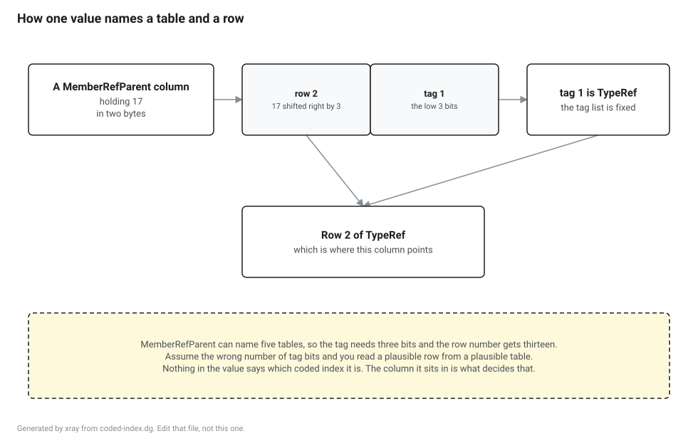

## 1. Purpose and scope

This document specifies how a managed image stores metadata as bytes, and nothing about what any of it means.

In scope: the five streams of the metadata section and how each one is addressed, the inventory of tables and the number that identifies each of them, the token encoding, the coded index encodings, and the rules that decide how wide every column of every row is.

Out of scope, with the document that carries it. The grammar of a signature blob is `BP-SIGNATURE`, and this document says only that a signature is a run of bytes in `#Blob`. The PE file the metadata section sits inside, and the CLI header that points at it, are `BP-PE`. The instruction stream a method body holds is `BP-IL`. The tables numbered from 0x30 upward, which a portable PDB uses and an assembly does not, are `BP-PDB`. What a runtime does with any of this when it loads a type is `BP-TYPELOADER`.

The boundary that matters most: an implementation of this document can turn a byte range into rows and columns and cannot tell you what a single one of those columns means. That is the correct amount, because every consumer downstream disagrees about meaning and none of them disagrees about layout.

## 2. Data structures

### 2.1 The streams

The metadata section opens with a root, which carries a version string and a count of streams, and then a header per stream giving that stream's offset, size and name. ECMA-335 II.24.2.1 for the root, II.24.2.2 for the headers.

Five stream names are defined. One holds the tables and the other four are heaps, which are byte arrays addressed by an index held in a table column.

| Stream | What is in it | How an index into it is read |
|---|---|---|
| `#~` | Every table, one after another | Not indexed. The whole stream is read in order |
| `#Strings` | Names: of types, of methods, of fields, of anything a row names | Byte offset. UTF-8, ending at the next zero byte |
| `#US` | The string literals of the program | Byte offset. A compressed length, then that many bytes of UTF-16, of which the last one is a flag rather than text |
| `#Blob` | Signatures, constant values, custom attribute arguments, public keys, marshalling descriptors | Byte offset. A compressed length, then that many bytes |
| `#GUID` | Sixteen byte values | Entry number, counting from one. No length and no terminator, because every entry is the same size |

Byte zero of `#Strings`, `#US` and `#Blob` is a zero byte that no real entry uses, so an index of zero into any of the three means absent rather than empty. `#GUID` counts from one for the same reason, and entry zero means absent.

A sixth name, `#-`, appears in place of `#~` in an image whose tables are unoptimized. Such an image carries the five indirection tables named in 2.2, and a reader that has assumed `#~` will not find them.

Two streams hold text and they share nothing. A literal that is also a type name is stored twice, once in each, because the two are separate byte arrays with separate index spaces and no encoding in common.

### 2.2 The tables

A table is an array of rows and every row in one table is the same width, so finding row n is one multiplication and one addition. The table's number is its identity: it selects the table in the token encoding of 2.3, it selects the bit that says whether the table is present, and it is the order tables appear in `#~`.

{{generated:tables}}

Thirty eight of these are ECMA-335 tables, which are the numbers 0x00 through 0x2C with seven gaps in them. The seven are not gaps in the standard, they are tables the standard does not define.

`FieldPtr`, `MethodPtr`, `ParamPtr`, `EventPtr` and `PropertyPtr` are indirection tables that exist only in an unoptimized image, the one whose tables stream is named `#-`. Where they are present, a row number in the corresponding real table is an index into the indirection table first, and the entry found there is the real row. A reader that ignores them reads the right number of rows in the wrong order.

`EncLog` and `EncMap` describe an edit and continue delta rather than a whole image, and are empty in anything a compiler emits as a finished assembly.

The numbers from 0x30 upward belong to the portable PDB format and are specified with it rather than in ECMA-335. They never appear in an assembly and they always appear in a portable PDB, and one of them shows up in 2.4.

### 2.3 Tokens

A token is four bytes. The top byte is a table number, taken from the first column of 2.2, and the low three bytes are a row number counting from one. A row number of zero is the absence of a row rather than the first row, everywhere, without exception.

Tokens appear in the instruction stream and inside signatures. They do not appear in table columns. A column that points at exactly one table holds a bare row number with no table byte on it, because the table is already known from the column, and a column that can point at several tables holds a coded index instead.

The three byte row number is a limit as well as an encoding. A table with more than 16777215 rows has rows that no token can name, and 2.5 makes clear that the row count in the header is a four byte number, so the two do not agree about how large a table may be.

### 2.4 Coded indexes

A coded index is one value carrying a row number and a small tag that says which table the row is in. The tag is in the low bits, the row number is above it, and the row number counts from one so that the whole value being zero means absent.

To decode: the tag is the value masked with the low n bits, the row number is the value shifted right by n, and n is a property of the coded index rather than of the value. Nothing in the bytes says which coded index is being read. That comes from the column, and the column comes from the table layout.

{{generated:coded}}

Thirteen of these fourteen are ECMA-335 II.24.2.6. The fourteenth, `HasCustomDebugInformation`, belongs to the portable PDB format, and it is here because it is encoded the same way and because a reader of both formats implements both from the same code. Its extra tags name the tables from 0x30 upward.

An unassigned tag is not a reserved value an implementation may pass through. It is a malformed image, and the correct behaviour is to reject it rather than to read the row number and hope.

### 2.5 How wide every column is

No row width in this format is a constant. Every one of them is computed from the header of `#~` before a single row is read, and an implementation that hardcodes a width works on the images it was tested against.

The header carries a HeapSizes byte and a Valid mask. The Valid mask has one bit per table number, and a row count appears in the header for each set bit and for no other, so the row counts are a packed array whose length is the number of set bits. ECMA-335 II.24.2.6.

Three rules produce every column width, and each of them can produce two or four bytes.

A column holding an index into a heap is two bytes unless the corresponding bit of HeapSizes is set, in which case it is four. Bit 0 covers `#Strings`, bit 1 covers `#GUID` and bit 2 covers `#Blob`. There is no bit for `#US`, because no table column indexes it.

A column holding a row number in one named table is two bytes if that table has fewer than 65536 rows, and four bytes otherwise.

A column holding a coded index of n tag bits is two bytes if every table that coded index can name has at most the row count in the last column of the first table in 2.4, and four bytes otherwise. That limit is smaller for a coded index with more tag bits, which is why `HasCustomAttribute` widens at two thousand rows while `HasFieldMarshal` survives to thirty two thousand, and why a large assembly has wide custom attribute columns and narrow ones everywhere else.

The width of a column therefore depends on the contents of tables it does not itself point at. Two images with the same tables and different row counts have different row widths, and neither one is wrong.
