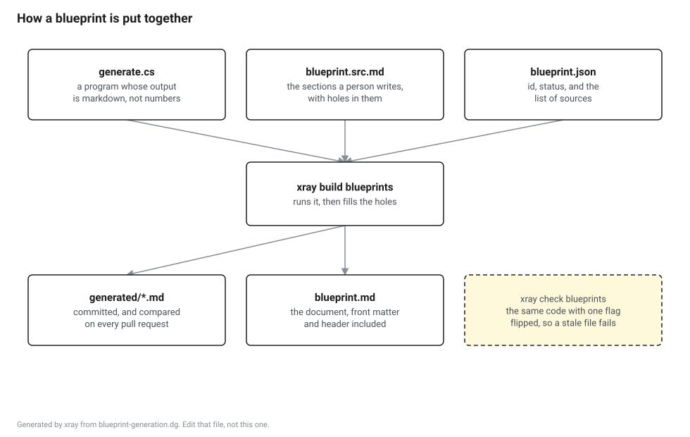

# The blueprint format

A lesson persuades. A blueprint asserts.

The two are written for different people at different moments. Somebody learning wants a hook, a surprise and a program they can run. Somebody implementing wants the layout, the encoding, the invariant and the edge case, and does not want to read a story to get to them. So the project writes both, and the two are allowed to be completely redundant with each other, because forcing either reader through the other one is how a document ends up serving neither.

The rule that makes this work is that a blueprint never points at the teaching side of the book. Not "as we saw", not "recall that", not "see the lesson for why". If an implementer needs it, it is in the blueprint, even if it has been said three times elsewhere. The tool checks this, because it is the rule an author breaks by accident on a Friday.

## Why it is machinery rather than a directory of markdown

The project claims that a specification of .NET can be generated from what the runtime and its libraries already publish, rather than transcribed by a person.

That claim is worth something only if it is checkable. A transcribed table is wrong in one row and nobody finds out for a year, and the reader who does find out has no way to tell whether the rest of the document has the same problem. A generated table is wrong the same way its generator is wrong, which is one place, visible in a diff, and regenerated on every pull request.



```
dotnet run --project tools/xray -- build blueprints
dotnet run --project tools/xray -- check blueprints
```

`build` runs the generator and writes what it produced. `check` does exactly the same work and then fails if what it produced is not what is committed. They are the same code path with one flag, which is the only arrangement in which the two cannot drift apart.

## The files

| File | Who writes it | What it is |
|---|---|---|
| `blueprint.json` | You | The id, the title, the part, the status, and the sources of truth |
| `generate.cs` | You | A program whose output is markdown. One block per generated section |
| `blueprint.src.md` | You | The sections, with a hole where each generated one goes |
| `generated/<id>.md` | The tool | What one block of the generator printed |
| `blueprint.md` | The tool | The document. Never edit this one |

A hole is written `{{generated:id}}` on a line of its own, and the id is the block id in `generate.cs`. There is one kind of hole, because a blueprint quotes results and never quotes the program that produced them. A blueprint with no generator is allowed, and its header says on the page that every line in it was written by a person.

Everything factual about the document is produced from `blueprint.json` and from where the holes actually are. The front matter, the title, the status sentence, the list of sources and the list of which sections are generated are all written by the tool, so none of them can be left saying something that stopped being true three commits ago.

## The nine sections

Nine, in this order, every time.

| # | Section | What goes in it |
|---|---|---|
| 1 | Purpose and scope | What this subsystem is responsible for, and what it is not, naming the blueprint that is. The boundary is the most useful sentence in the document and it goes first |
| 2 | Data structures | Every structure, every field, every offset, every flag bit. Layouts as tables, not as prose |
| 3 | Algorithms | The operations, numbered, complete enough to implement from. No paragraph standing in for a step |
| 4 | Invariants | What is always true, as checkable predicates, each with the scope it holds over |
| 5 | Observable behaviour | What an outside observer can determine, and how. Named APIs, named environment variables, named events |
| 6 | Edge cases and error paths | Failure modes, degenerate inputs, races, and the cases that exist only because of history |
| 7 | Interactions | Which other subsystems this one constrains and is constrained by, by blueprint id, with the coupling named |
| 8 | Conformance | What the standard requires, what the augments change, what CoreCLR does that neither requires, and what an implementation may choose freely |
| 9 | Port notes | What is hard, what is platform specific, what is CoreCLR specific, and what a different language or memory model has to solve differently |

Section 6 is researched before section 3 is written. Edge cases come from tests, issue threads and comments that begin "note that", and algorithms come from reading code. Doing the harder research first is the only way it does not get skipped when the deadline arrives.

## Drafts

A blueprint's status is `draft` or `complete`, and it says which on its own first page.

A draft may leave sections out. It may not invent one, rename one, or put them in a different order, and the tool enforces all three. Leaving a section out is deliberate: a section written to fill a slot is worse than an absent one, because an absent section is visible and a thin one looks finished.

A `complete` blueprint has all nine, and the tool refuses to call it complete otherwise.

## What the tool refuses

A hand edited generated file. This is the whole point of the arrangement, and it fails on every platform in CI rather than in review.

A section that is not one of the nine, a section whose title does not match the template, or sections out of order.

A sentence that points at the teaching side of the book. The words are `lesson`, `chapter`, `as we saw`, `recall that`, `earlier we` and `you will remember`.

A blueprint with no source of truth, which is somebody's opinion with a template around it.

A generator block that produces nothing, because the section it fills would be empty and the page would not say so.

## The worked example

[BP-METADATA](../blueprints/bp-metadata/blueprint.md) is a draft with sections 1 and 2 written, and two of its subsections are generated.

Its generator opens no files. It derives the whole table inventory from one enumeration, and the whole coded index encoding from fifteen methods that `System.Reflection.Metadata` already ships, by encoding row one of every table with every coded index in turn and reading the tag width back out of the result. The library refuses the pairs that are not allowed, and what is left is the encoding.

That is worth doing rather than typing for a specific reason. Coded index tag widths are the thing a metadata reader is most often subtly wrong about, the failure shows up a long way from the mistake, and a table of ninety odd tag assignments is exactly the kind of thing a person transcribes with one error in it.
