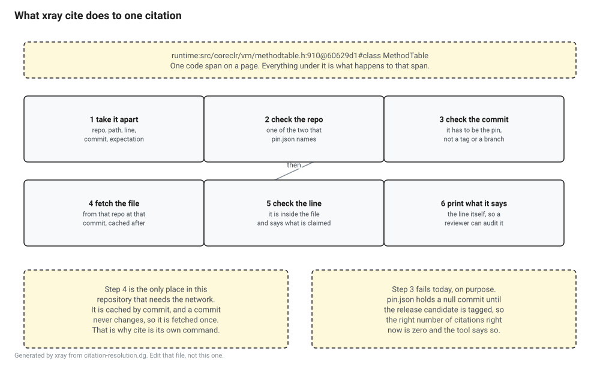

# The citation format

A claim about the runtime that points at a file name and a line number is worth almost nothing. Files move, lines shift, and the reader who goes to check finds a different function there and no way to tell whether the book was wrong or the runtime changed underneath it. Six months later nobody knows which.

So a citation in this repository names a repository, a path, a line and a commit, and `xray cite` fetches it. A citation that does not resolve fails the build.

```
dotnet run --project tools/xray -- cite
dotnet run --project tools/xray -- cite --selftest
```

## What one looks like

```
runtime:src/coreclr/vm/methodtable.h:910@60629d1#class MethodTable
```

Written on a page it goes in backticks, and that is the whole of how the tool finds them: an inline code span that starts with a pinned repository key and a colon is a citation, and nothing else is.

| Part | Meaning |
|---|---|
| `runtime` | Which pinned repository. There are two, `runtime` and `roslyn`, and they come from `pin.json`. |
| `src/coreclr/vm/methodtable.h` | The path inside it, from the root, with forward slashes on all four platforms. |
| `910` | The line. `909-911` cites a range. Leaving it out cites the whole file. |
| `60629d1` | The commit, seven to forty hex digits, and it has to be the pinned one. |
| `class MethodTable` | Optional. Text the cited lines have to contain. |

The last field is the one worth being deliberate about. Without it the checker can prove the file exists and has that many lines in it, which catches a path that moved and not a line number that is off by twelve. With it, the citation says what it expects to find, and a wrong line number becomes a red build instead of a reader's confusion. Use it for anything a lesson leans on.

## Why the commit and not the tag

A tag is not a commit. Both pinned repositories use annotated tags, so the name `v10.0.0` points at a tag object, the tag object points at a commit, and the two have different hashes. Resolving the name and writing down what came back gets you a hash that is real, is in the repository, and is not the commit, and fetching a file at it returns nothing. That is not a hypothetical, it happened while this checker was being written, and the self test carries a comment about it.

Branches are worse. `main` resolves today and to something else tomorrow, which is the exact failure the format exists to prevent.

## What the checker does



For every citation, in order: take it apart, check the repository key is one of the two pinned, check the commit matches the pin, fetch the file from that repository at that commit, check the line is inside it, and check the expectation if there is one.

Then it prints the line it resolved to. That last part is not decoration. A tick next to a citation tells you a machine looked at something. Printing the text tells a reviewer reading the log what the citation actually points at, and it is the difference between a check and a check somebody can audit.

Fetched files are cached under the commit, so the second run is free and a pull request touching one paragraph does not pull half of `dotnet/runtime`. A commit never changes, so the cache never needs clearing. `XRAY_CITE_CACHE` moves it.

## Why it is a separate command

`xray cite` is the only check in this repository that needs the network. Everything else builds on a train.

Folding it into `xray check` would mean either failing that command offline or skipping the citations quietly, and the second one is how a gate ends up not working for a year without anybody noticing. So it is its own command and its own CI job, and if it cannot reach GitHub it stops with a message about the network rather than reporting problems about citations.

## There are no citations yet

`pin.json` holds a null commit for both repositories until the .NET 11 release candidate is tagged. A citation carrying any other commit is rejected, so until the pin lands the correct number of `runtime:` citations in this repository is zero, and `xray cite` says so out loud rather than printing a silent pass.

That is a real problem for a gate. Zero citations and a checker that does nothing look identical from the outside.

## So the gate proves it can go red

`xray cite --selftest` carries its own pin, at two commits in `dotnet/runtime` and `dotnet/roslyn` that are tagged releases and are therefore never going to move. It runs both halves of the checker against it.

Sixteen parsing cases, five that should parse and eleven that should not: no commit, a branch, a tag, line zero, a backwards range, a line that is not a number, an absolute path, a Windows path, a path walking out of the repository, no path, and a hash with nothing after it.

Six scanning cases, on a page written for the purpose, which check that a citation in running prose is found with its line number and its expectation intact, that an example inside a fenced code block is not treated as a claim, and that a malformed citation is reported rather than skipped.

Ten resolution cases, over the network, against those two repositories. Four resolve. Six are refused: a line past the end of the file, a line that does not contain what the citation claims, a path that is not there at that commit, a commit that is not the pin, any citation while the pin is null, and a repository nobody pinned.

Every refusal is checked for the reason as well as the verdict, because a rejection with a message that does not say what is wrong is half a gate.

## Getting out of the way

A sentence that quotes a citation as an example rather than making a claim puts `xray-cite: allow` in an HTML comment on the line. The rule this repository already uses for the prose linter, kept the same on purpose: an opt out is visible in the diff, so it is a thing somebody chose rather than a setting somewhere else.

Fenced code blocks are skipped without a marker, which is why the examples on this page do not need one.

## What this does not catch

A reference somebody wrote as ordinary prose, with no prefix, is invisible here. The format gives review something mechanical to point at. It does not find the references a writer chose not to write down, and that one stays a human job.

A citation that resolves and is irrelevant. The checker can prove that line 910 of that file at that commit says `class MethodTable`. It cannot prove that `class MethodTable` supports the sentence in front of it.

Drift. Every citation here is frozen at a commit, so none of them can rot in place. What happens instead is that the pin moves, and then every citation is against a commit that is no longer the pin and the build goes red until they are all revisited. That is the intended behaviour and it is also the input to the drift ledger, which is M10's problem and is not built yet.
