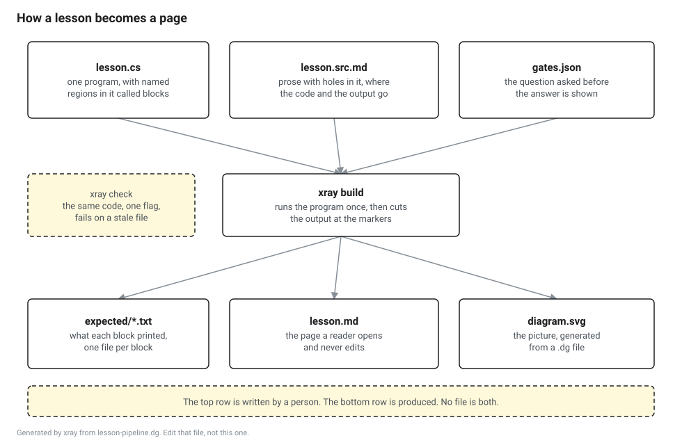
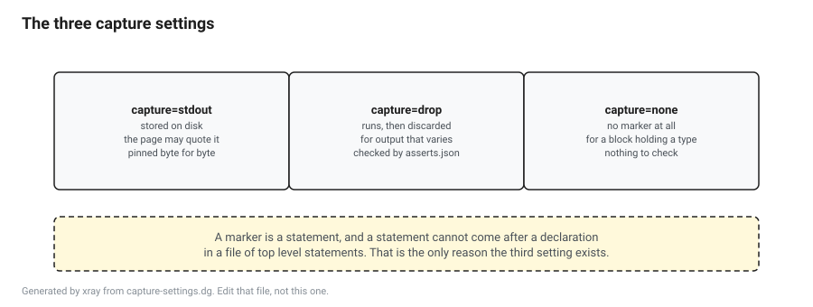

# The diagram format

A picture committed next to a page it no longer matches is the same defect as a number typed by hand, and it is worse in one way: nobody reads a picture twice, so it can stay wrong for a year.

So a diagram in this repository has a source file. The picture is generated from it, and the check that regenerates it is the check that fails the build.

| File | Who writes it | What it is |
|---|---|---|
| `name.dg` | You | The diagram. Text, reviewable in a diff. |
| `name.svg` | The tool | What a page shows. No script, no external font. |
| `name.excalidraw` | The tool | A scene you can open, drag around and steal from. |

```
dotnet run --project tools/xray -- build docs
dotnet run --project tools/xray -- check docs
```

The Excalidraw file is an export and not an input. Editing it produces changes the next build throws away. It exists because a picture you can open and rearrange is worth more than one you can only regenerate, and the way to propose a better layout is to change the coordinates in the `.dg` and send that.

## The format

One directive per line. A line starting with a hash is a comment, which is where you explain a coordinate you picked by eye. Anything in double quotes is one piece of text, spaces and all.

| Directive | Meaning |
|---|---|
| `title Some words` | The heading, drawn at the top left. |
| `size 980 640` | The canvas, in the units everything else is in. |
| `box id x y w h "heading" "line" "line"` | A thing that exists. Solid border, white fill. |
| `note id x y w h "line" "line"` | A remark about a thing. Dashed border, tinted, no bold first line. |
| `strip id x y w h "a" "b" "c"` | Equal cells laid left to right, `w` and `h` being one cell. |
| `arrow from to "label"` | A line with a head on it. The label is optional. |

A box and a cell name a thing, so their first line is set in bold as the name of it. A note is somebody talking, and a remark with a bold first line reads like a banner, so notes are set evenly.

Cell text can carry more than one line by splitting on a vertical bar: `"capture=drop|runs, then discarded|for output that varies"`.

A strip's cells are addressable as `id.0`, `id.1` and so on, so an arrow can point at one region of a layout rather than at the whole thing.

## Where an arrow leaves and arrives

The tool picks the sides. It compares the clear space between the two boxes sideways against the clear space between them up and down, and leaves by whichever is wider.

That sounds like a detail and it is the difference between a readable picture and a bad one. Two boxes in different rows and far apart sideways have almost no gap beside them and a wide gap below, and an arrow that leaves sideways there travels backwards across its own start. Measuring the gap sends it down instead, which is what a person drawing the same picture would do.

## What the tool refuses

A line of text wider than the box it sits in. The width is estimated rather than measured, because measuring would mean shipping a font with the tool, and the estimate is generous. A diagram that trips this really does overflow, and the fix is a shorter line or a wider box, not a bigger coefficient.

A shape hanging off the canvas.

An arrow naming a shape that does not exist, two shapes with the same name, or a quote that is opened and never closed.

## Two examples

Both of these are built by CI on every pull request, so if one of them is wrong, the build is red.



That one is boxes and arrows. Here is the source it came from.

```
title How a lesson becomes a page
size 980 640

box src   40  60 260 110 "lesson.cs" "one program, with named" "regions in it called blocks"
box prose 330 60 300 110 "lesson.src.md" "prose with holes in it, where" "the code and the output go"

box  tool 320 250 340 90 "xray build" "runs the program once, then cuts" "the output at the markers"
note chk   40 250 240 90 "xray check" "the same code, one flag," "fails on a stale file"

arrow src tool
arrow prose tool
```



That one is a strip, which is how a layout of adjacent regions gets drawn without anybody adding up offsets by hand. It is the shape most of this book's pictures want, because a metadata table, a method table and an object header are all a run of adjacent regions.
