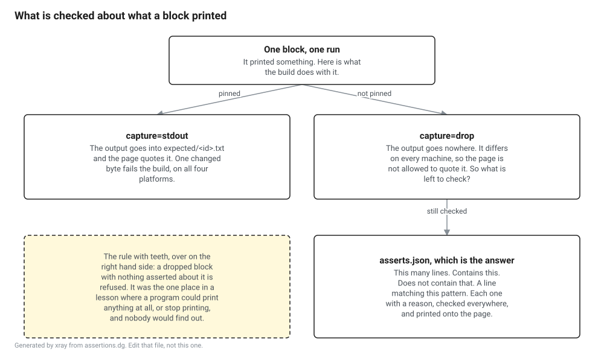
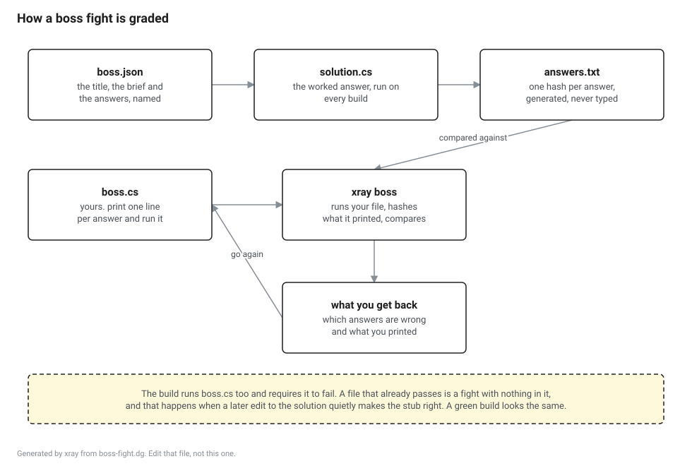

# The lesson format

A lesson is a directory. Everything in it is either something a person wrote or something the tool produced from what a person wrote, and the two are never the same file.

| File | Who writes it | What it is |
|---|---|---|
| `lesson.cs` | You | One program. The book quotes regions of it and runs the whole thing. |
| `lesson.src.md` | You | The prose, with holes in it where the code and the output go. |
| `gates.json` | You | The prediction gates, if the lesson has any. |
| `asserts.json` | You | What is true of a block's output, for output the page cannot show. |
| `fixture/` | You | An optional tiny project the lesson reads, built before the lesson runs. |
| `boss/boss.json` | You | The boss fight: a title, a brief, and the list of things to work out. |
| `boss/boss.cs` | You, then the reader | The starting file, with the parts the reader has to write left out. |
| `boss/solution.cs` | You | The worked answer, which is also what generates the answer file. |
| `boss/answers.txt` | The tool | A hash per answer, so the grader can be right without the answer being in a file. |
| `expected/*.txt` | The tool | What each block printed, one file per block. |
| `lesson.md` | The tool | The page. This is what a reader opens. |


Two commands do all of it.

```
dotnet run --project tools/xray -- build lessons
dotnet run --project tools/xray -- check lessons
```

`build` runs every lesson and writes the generated files. `check` does exactly the same work and then fails if what it produced is not what is committed. CI runs `check` on linux-x64, linux-arm64, win-x64 and osx-arm64, which is what stops a lesson from being right on one machine and wrong on the page.

Everything on a page therefore rests on that comparison, so there is a third command whose whole job is to distrust it.

```
dotnet run --project tools/xray -- check --selftest
```

That copies a real lesson and a real blueprint, hand edits the generated files in five different ways, and requires the check to object to each one by name. Two more cases change nothing and have to pass, because a harness that failed on everything would otherwise report a clean sweep. A comparison that always passed would look exactly like a repository where nobody had ever hand edited anything, and nobody would find out which one this is until a reader noticed a page saying something the program does not.

## Blocks

A block is a named region of `lesson.cs`, marked by two comments.

```csharp
//# block id=tables env=E0 tags=[metadata] capture=stdout
var reader = new MetadataReader(pointer, length);
Console.WriteLine(reader.GetTableRowCount(TableIndex.TypeDef));
//# end
```

The directives are comments, so the file compiles and runs on its own. A reader who clones the repository and types `dotnet run lesson.cs` in the lesson directory gets the whole program in order, and never sees a block boundary.

| Attribute | Default | What it means |
|---|---|---|
| `id` | required | The name the page uses to quote this block. Unique within the lesson. |
| `env` | `E0` | `E0` is the stock SDK, `E1` needs a runtime built from source, `E2` needs a checked build. |
| `tags` | empty | A list in square brackets, used for indexing lessons later. |
| `capture` | `stdout` | One of `stdout`, `drop` or `none`. See below. |

## How a block is run, and why it is not run alone

The tool copies `lesson.cs`, inserts one line at the top of each block that prints a marker, runs that copy once, and then cuts the captured output at the markers.

Running each block in a separate process would be tidier and would be wrong. A lesson is a sequence. The block that reads a header depends on the block that opened the file, and the block that reports on the heap depends on the block that allocated into it. Cutting the output afterwards keeps the lesson a program rather than a list of snippets.

Everything printed before the first marker is discarded, so a cold restore that writes to standard output cannot corrupt the first block.

## The three capture settings


`capture=stdout` is the normal one. The block is marked, its output is stored in `expected/<id>.txt`, and the page can quote it. Use it when the output is the same on every machine that runs it.

`capture=drop` marks the block and throws the output away. Use it when the block prints a path, a timing, a pointer, a thread identifier or anything else that differs between two runs or two platforms. The page can show the code and cannot show the output, which the tool enforces rather than trusting. A dropped block still has to say what is true of its output, in `asserts.json`, and that is the next section.

`capture=none` does not mark the block at all. That is the only setting a block holding a type or a helper can use, because the marker is a statement, and a statement cannot come after a declaration in a file of top level statements. A block with this setting is quoted and never quoted back.

## Assertions

For most of this project's life the paragraph above was the end of the story for a dropped block, and that was the one hole left in the whole arrangement. A `stdout` block is pinned byte for byte and any change to it fails the build. A dropped block could print anything at all, or quietly stop printing, and nothing would notice, because the only thing reading its output was the bin.



`asserts.json` closes it. You say what is true of the output whatever machine produced it, the build checks it on all four platforms, and the page prints the list under the code.

```json
[
  {
    "block": "sizes",
    "claims": [
      { "lines": 4, "why": "Four heaps, one line each." },
      { "matches": "^Guid .* runs for +16 bytes$", "why": "Every entry in this heap is sixteen bytes and this assembly has one entry." },
      { "matches": "^String +starts at +[0-9]+ and runs for +[1-9][0-9]* bytes$", "why": "An assembly that defines a type always has names to put somewhere." }
    ]
  }
]
```

There are four kinds of claim and one claim sets exactly one of them.

| Claim | Holds when |
|---|---|
| `contains` | The output has that text in it somewhere. |
| `absent` | The output does not have that text in it anywhere. |
| `matches` | Some line of the output matches that regular expression. |
| `lines` | The output is exactly that many lines. |

`matches` is multiline, so `^` and `$` mean the ends of a line rather than the ends of the whole blob, which is what anybody writing a rule about a table of output expects. Patterns are compiled when the file loads, so a broken one fails once with the file named rather than in the middle of a run on whichever platform got there first, and matching is given two seconds, so a pattern that backtracks forever is a build that fails rather than a build that hangs.

**Every dropped block needs at least one claim, and there is no way out of that rule.** A dropped block with nothing asserted about it is exactly the hole this feature exists to close, so leaving one open is refused with the block named.

**Every claim needs a `why`.** It is not a comment. It is the sentence a reader gets on the page and the sentence whoever broke the build gets in the log, and an invariant nobody can explain is one somebody deletes the first time it goes red.

Assertions are allowed on a `stdout` block too, where they read differently: the bytes are already pinned, so the assertion is not adding a check so much as saying which part of the pinned output is load bearing. A change to that part then fails with a reason attached rather than as a diff.

Pick the weakest claim that says the true thing. The example above pins the size of `#GUID` because the specification fixes it, and says of the strings heap only that it is not empty, because everything else about it moves when the compiler moves. An assertion that pins a number the compiler is free to change is a red build every time the SDK moves, and those teach people to ignore red builds.

```
dotnet run --project tools/xray -- assert lessons
dotnet run --project tools/xray -- assert --selftest
```

`build` and `check` evaluate the same assertions and mention only the failures, which is right for a gate and unhelpful while you are writing one. `xray assert` runs the lessons and prints every claim, passing ones included, so you can see that the rule you have written is testing what you meant rather than passing because it is vacuous. That failure mode is the one worth worrying about here: an assertion that guarantees nothing reads on the page exactly like an assertion that guarantees something. `--selftest` runs twenty six cases, half of them about refusing output that does not hold, because only that half can tell the two apart.

## Transclusion

`lesson.src.md` is ordinary markdown with four kinds of hole in it. A hole is a line of its own, and the whole line is replaced.

| Hole | Becomes |
|---|---|
| `{{block:tables}}` | The source of that block, in a fenced C# listing. |
| `{{output:tables}}` | What that block printed, in a fenced text listing. |
| `{{gate:g1}}` | A prediction gate, folded so the answer is not visible until it is opened. |
| `{{asserts:tables}}` | What is checked about that block's output, one bullet each. |
| `{{boss}}` | The boss fight, written out from `boss/boss.json`. It names nothing because a lesson has one. |

There is no way to write output into the page by hand. There is no way to quote a block that does not exist. Both are errors that fail the build with the file and the name in the message.

## Numbers

Every other guarantee here is downstream of one sentence: no number in a lesson is typed by a person. A page whose listings are generated and whose prose says the header is sixteen bytes because somebody measured it once in a debugger goes quietly wrong at the next version bump, and it goes wrong in the half a reader is most likely to believe.

`xray numbers` is the gate. It reads `lesson.src.md`, not the generated page, and it has two rules.

**A number that is already in this lesson's captured output is a defect, and there is no excuse for it.** The number is sitting a few lines up the page inside a transclusion. Retyping it means the page can disagree with itself, and it will, the first time the output changes.

**Any other bare number needs a reason written on the line**, as `<!-- literal: why this is not a measurement -->`. The reason has to say something. An empty one is refused, because an escape hatch with nothing written in it is a checkbox.

A number is a run of digits with no letters anywhere in it. That one line is the whole definition and it is doing more work than it looks like, because a letter turns a token into a name: `x64` is a platform, `UTF-16` is an encoding, `M05` is a lesson, `II.24.2.1` is a clause of the standard, `v4.0.30319` is a version string and `0x1F` is written the way the runtime writes it. None of those is anybody reporting a measurement, and a rule that argued with them is a rule people turn off. Front matter, fenced blocks, transclusion lines and link targets are skipped for the same reason.

The hole in it, said plainly: writing "sixteen" instead of `16` gets past this gate. Closing that would mean a check that trips on the word "sixteen" everywhere it legitimately appears, which is a check nobody would keep. So the words are review's job and the digits are the machine's, and the two rules above are the part that can be guaranteed.

`xray numbers --selftest` runs ten cases against throwaway lessons on disk, because this gate is one loosened rule away from passing everything and the day it does, the repository keeps printing a green tick under a claim it is no longer checking.

## Gates

A gate asks the reader what will happen before the output is shown to them. It lives in `gates.json` as a question, a list of options with exactly one marked correct, a sentence explaining each option including the wrong ones, and a closing paragraph for the thing the answer does not cover.

```json
[
  {
    "id": "g1",
    "question": "What does the second call print?",
    "options": [
      { "text": "Zero.", "correct": false, "why": "The counter was already incremented by the first call." },
      { "text": "One.", "correct": true, "why": "The increment happened before the read, and both are on the same thread." }
    ],
    "after": "The interesting case is two threads, and that is the next lesson."
  }
]
```

The rendered gate is a details element, so it folds on a plain GitHub page with no site build and no script. Every wrong option gets a real explanation, because a reader who picked one is the reader most likely to still be confused after the answer.

## Boss fights

A chapter that ends with "now try it yourself" ends with nothing, because the reader has no way to find out whether what they wrote is right, and the ones who most need to find out are the ones least able to tell. So every fight here is graded by a program.



A fight is a directory with three files in it that a person wrote. `boss.json` says what the fight is and lists the answers by name.

```json
{
  "title": "Read the lesson the way the tool reads it",
  "brief": "Open lesson.cs, work out the three answers below, and print each one from boss.cs.",
  "questions": [
    { "key": "directives", "ask": "How many blocks does lesson.cs declare?" },
    { "key": "first", "ask": "What is the id of the first block in the file?" }
  ]
}
```

`boss.cs` is what the reader gets. `solution.cs` is the worked answer. Both are ordinary file based apps that run with the lesson directory as their working directory, and both report by printing one line per answer.

```
answer directives = 4
answer first = blocks
```

The reader runs one command, as many times as it takes.

```
dotnet run --project tools/xray -- boss lessons/smoke-pipeline
```

The grader names each answer that is wrong, repeats the question, and shows what the reader printed. It does not say what the right answer is. `answers.txt` holds a hash rather than a value, which is not security and is not meant to be, since the worked solution is sitting in the same directory. It is there so the answer is not lying in plain sight in a generated file in front of somebody who has not decided to look it up yet.

`build` and `check` both run `solution.cs`, regenerate `answers.txt`, and then run `boss.cs` and require it to fail. That last part is the one that earns its keep. A starting file that already passes is a fight with nothing in it, and the way that happens is never carelessness at the time, it is a later edit to the solution that quietly makes the stub correct. Nobody notices, because a green build looks the same either way.

## Fixtures

A lesson that needs something to look at gets a `fixture/` directory holding a small project, and the tool builds it in Release before the lesson runs. The lesson then reads the built output by relative path.

A fixture is a project rather than a committed binary on purpose. A committed `.dll` is a number typed by a human in the one format nobody can review, and it stops being true the moment the pin moves.

## What the tool refuses

Output containing the path of the directory it ran in, or a path out of the home directory of the machine it ran on. An expected file with a laptop's home directory in it matches on one laptop and fails on the fourth platform, and the message you get there is much worse than the message you get here.

A block that never printed its marker, which means the program exited before reaching it. That includes a dropped block, whose output nobody reads and which still has to have run.

A gate with no correct option, or with two.

A dropped block with nothing asserted about it, an assertion on a block that does not exist, an assertion that sets none of the four claim kinds or more than one of them, and an assertion with no reason written on it.

A transclusion naming a block or a gate that does not exist, or asking for the output of a block that does not store any.

A boss fight whose solution never prints one of the answers it promised, and a boss fight whose starting file already passes.

## Determinism

Lessons run with `DOTNET_SYSTEM_GLOBALIZATION_INVARIANT=1` set, so a number formats the same way on all four platforms. Line endings are normalised to one form before anything is compared, so Windows does not disagree with the other three about every line of every file.

Anything else that varies is the lesson author's problem, and the answer is almost always `capture=drop` plus the assertions that say what stays the same about it.
