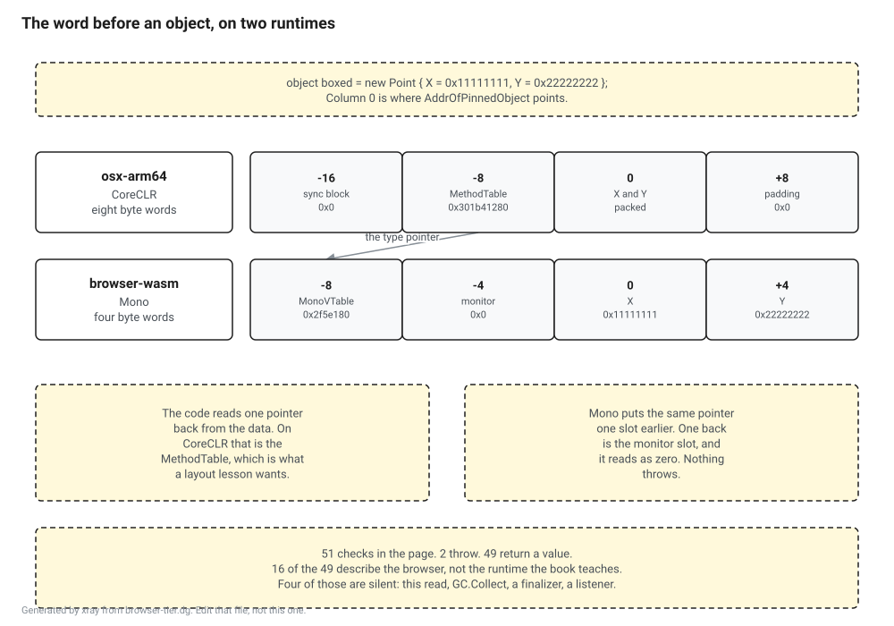

# Probe: what actually runs in the browser

**Question.** The E2 tier is running lesson code in the page with no install. Which parts of `ClrXray` survive that, and which do not?

**Answer. Almost nothing throws, and that is the problem.** Fifty one checks were run in a real browser. Two throw. Forty nine return a value, and sixteen of those return a browser answer that is not the runtime answer the book teaches. Four of the sixteen are silent: the code returns, the number looks plausible, and it is wrong. The edge of the browser tier is not where the API surface ends. It is where the answers stop meaning what a lesson says they mean.

**Measured on 2 September 2026** with SDK 10.0.400, .NET 10.0.11, Chrome on osx-arm64 against `browser-wasm`, with the desktop column taken on both osx-arm64 and linux-x64. `pin.json` still holds null commits, so this is the .NET 10 substrate rather than the pin, and the runtime pack section below explains why that gap matters more here than it did in the other probes.

## How it was measured

One class, `Probe.cs`, with fifty one checks in it. Each check is a name and a lambda that returns a string, wrapped in a try so that a throw is a result rather than the end of the run. Every result is printed as `PROBE|group|name|status|detail`.

The same file is compiled twice. Once into a Blazor WebAssembly app, where `Probe.RunAll()` is called from `Program.cs` and the output lands in the browser console. Once into a console app, where it lands on standard output. One list of checks, no chance of comparing two lists that merely look alike.

The console half was run on two machines, this laptop and `server1`, so that the desktop column is CoreCLR's answer rather than one operating system's. osx-arm64 and linux-x64 agree on every row that carries an argument here, the object header included. Only the machine names, the addresses and the counters differ, which is what you would want and is not what you should assume.

The checks read a PE image, and that image is a small `netstandard2.0` library carried as an embedded resource rather than fetched from disk. That is not laziness. Blazor serves its own assemblies as Webcil, which is a different container from the PE the metadata lessons teach, so a lesson that wants to show a reader a real PE has to ship one. The probe does what the lesson would have to do.



## What the browser refuses

Two checks, and the compiler knew about both before the app ran.

```
PROBE|observation|start a thread|threw|PlatformNotSupportedException: Arg_PlatformNotSupported
PROBE|observation|Process.GetCurrentProcess|threw|PlatformNotSupportedException: Process_PlatformNotSupported
```

Building the same file for `browser-wasm` produces three `CA1416` warnings, and they name exactly these two APIs. The platform compatibility analyzer is right about everything it is asked about, and what it is asked is whether an API is supported. Whether the answer is true is a different question and nobody is asking it.

That gap is the finding. The analyzer flagged two checks. Sixteen more behave differently and it flagged none of them, because none of them is unsupported.

## What the browser gets exactly right

Every metadata check returns the same string in both columns.

```
PROBE|metadata|open a PE image|ok|HasMetadata=True, sections=3
PROBE|metadata|table row counts|ok|TypeDef=4, MethodDef=3, Field=4
PROBE|metadata|read a name from the string heap|ok|Point,Box`1,Arithmetic
PROBE|metadata|decode a method signature|ok|!0 (int32, string)
PROBE|metadata|read a method body|ok|6 IL bytes, maxStack=8, first bytes 02 03 58 18 5a 2a
PROBE|metadata|read the blob heap|ok|blob heap size 248 bytes, first typedef <Module>
```

`System.Reflection.Metadata` is managed code over a byte array, so this was likely. Likely is not measured. Part II runs in the page with no caveat at all, and the IL bytes a reader sees there are the bytes on the desktop.

Three things that were not obvious also work. `Assembly.Load` over a byte array loads. A collectible `AssemblyLoadContext` loads and unloads. `DynamicMethod` with an `ILGenerator` emits three opcodes and calls them, and `Expression.Compile` works as well, which means a lesson can build IL in the page and run it even though there is no JIT down there in the sense the book means.

Value type layout is identical too. `Unsafe.SizeOf<Point>` is 8, `Marshal.SizeOf<Point>` is 8, `Marshal.OffsetOf` for the second field is 4, and `typeof(string)` reports its private fields as `_stringLength,_firstChar` in both places. The parts of Part III and Part IV that are about how fields pack are fine.

## What the browser gets wrong quietly

The check that matters most is the one every layout lesson eventually writes. Pin an object, step back one pointer, read the type pointer.

```
osx-arm64   -16:0x0        -8:0x301b41280     0:0x2222222211111111   +8:0x0
linux-x64   -16:0x0        -8:0x7c3337320408  0:0x2222222211111111   +8:0x0
browser      -8:0x2f5e180  -4:0x0             0:0x11111111           +4:0x22222222
```

Both runtimes put a two pointer header in front of the data, and they put the two pointers in opposite order. CoreCLR is sync block then method table, so the pointer immediately before the data is the method table. Mono is vtable then monitor, so the pointer immediately before the data is the monitor, and for a freshly boxed value it is zero.

The read does not throw. `Marshal.ReadIntPtr` is perfectly happy. A lesson that prints "the method table pointer for this object is" and then prints `0x0` has told the reader something false, and nothing anywhere in the stack objects.

The collector checks fail the same way.

```
PROBE|gc|force a collection|ok|gen0 count 0 then 0
PROBE|gc|does a finalizer run|ok|no, the finalizer had not run when the check returned
```

`GC.Collect()` returns and the gen 0 collection count has not moved. Collection is not broken: allocating fifty megabytes in small objects drives that count from 0 to 13, so the collector is running. It is that an explicit request does not do the thing the lesson is about to explain. The finalizer check is worse, because `WaitForPendingFinalizers` also returns and the finalizer has still not run.

`EventSource` is the fourth. A source and a listener are both created without complaint, the event is written, and the listener counts zero.

Those four are the silent ones, and they are why this probe's answer is not the one the question expected.

## The other twelve

These differ as well. A reader can see that they differ, which makes them a smaller problem.

| Check | Browser | Desktop |
|---|---|---|
| `IntPtr.Size` | 4 | 8 |
| Mono types present | yes | no |
| `Assembly.Location` | empty | a file path |
| `Dictionary<string,int>` private fields | 9 | 10 |
| the object word against `TypeHandle.Value` | not equal | equal |
| `GCSettings.LatencyMode` | `Batch` | `Interactive` |
| `IsServerGC` against the app switch | `False` against `True` | both `False` |
| `System.GC.Server` in `AppContext` | `true` | unset |
| `PackedSimd.IsSupported` | `True` | `False` |
| stack trace depth from the same place | 15 frames | 4 frames |
| `Environment.ProcessorCount` | 1 | 10 |
| `GC.GetGCMemoryInfo` heap size | 823264 | 73264 |

Two of those deserve a sentence each. `GCSettings.IsServerGC` says false while `AppContext` says the `System.GC.Server` switch is true, which is a contradiction inside one process and would derail a lesson on GC flavours whichever of the two it printed. And the private field count on `Dictionary` differs, which is a small concrete reminder that the corelib in the page is compiled for a different runtime and its shapes are its own.

`PackedSimd.IsSupported` being true in the browser and false on the desktop is the one row in the table that is a capability the browser has and the desktop does not.

## What the reader downloads

A trimmed release publish of the probe app, with `InvariantGlobalization` set the way `Directory.Build.props` already sets it:

```
56 files, 7.1 MB on disk, 2.4 MB brotli compressed
largest: dotnet.native.wasm 2.9 MB, System.Private.CoreLib 1.6 MB
```

Leaving globalization in adds three ICU data files and takes it to 9.7 MB and 3.0 MB compressed. Invariant is the right setting and it is already the setting, so the number to plan around is 2.4 MB for a page that can read metadata and emit IL. That is a fair cost for a lesson and it is not a fair cost per lesson, so whatever the site does it should load the runtime once and keep it.

## Which runtime, and why the pin changes the question

The issue says Blazor WebAssembly is still Mono. On the substrate this repository builds on today that is not merely true, there is nothing else to reach for.

```
Microsoft.NETCore.App.Runtime.Mono.browser-wasm   168 versions, 21 in 10.x, 7 in 11.x
Microsoft.NETCore.App.Runtime.browser-wasm         31 versions,  0 in 10.x, 4 in 11.x
```

The second is the CoreCLR build for the browser. It has no 10.x version at all, and its four 11.x versions are `preview.4` through `preview.7`. Asking for it on `net10.0` fails in the SDK rather than at runtime:

```
error WASM0005: Unable to resolve WebAssembly runtime pack version
```

So the browser column above is a Mono column, and it stays a Mono column for as long as this repository targets `net10.0`. At the pin the pack exists. Whether Blazor can be pointed at it, and whether the four silent checks behave differently when it is, is not measured here, because no machine this project builds on has a .NET 11 SDK yet. That is the single most useful thing to rerun at the release candidate, and it is likelier to move this page's conclusions than any other rerun in the M0 set.

## What this decides

The plan says E2 covers Parts II, III and IV. That is one part too many.

**Part II is E2 with no caveat.** Every metadata, signature and IL check is byte for byte identical to the desktop.

**Part III is E2.** Field packing, sizes and offsets agree.

**Part IV is not E2**, and the reason is the object header. The header is the subject of Part IV, and the header in the page is a different header with the two words in the other order. A reader can be taught Mono's header honestly, but that is a different lesson from the one this book is writing, and putting it behind an E2 badge on a page that says method table would be teaching the wrong thing to the readers least equipped to notice.

**Part VI onward is not E2**, which the plan already said, but not for the reason the plan gave. It is not that the APIs are absent. `GC.Collect`, `GCSettings` and `GC.GetGCMemoryInfo` are all there and all answer. They answer about a collector the book does not describe.

The change this forces on the design is small and worth making now rather than at M5. A per lesson tier badge is not enough by itself, because a badge tells the reader what to expect and does not stop the code. The browser build of `ClrXray` should refuse to run the header module and the collector module, throwing an exception we write with a message that names the runtime underneath, rather than letting Mono answer and trusting that the badge was read. Four checks in this probe show what the alternative looks like, and a reader who hits one of them has been handed a wrong number by a book whose whole argument is that its numbers are generated rather than typed.

## Rerunning it

`browser-tier/run.sh` builds the sample library, scaffolds a stock Blazor WebAssembly app, drops `Probe.cs` into it, runs the desktop column on standard output, and serves the browser column on `http://127.0.0.1:5199`. The browser results are in the page's console, prefixed with `PROBE|`.

```
./docs/probes/browser-tier/run.sh
```

The transcripts from the run this page describes are in `browser-tier/results.txt`, all three columns, unedited.

It is not run by CI. The browser half needs a browser, and the point of the measurement is a comparison a person has to look at.

## What this probe did not measure

Chrome on osx-arm64 only. Firefox and Safari were not tested. The differences that matter here are Mono's rather than the engine's, but that is an argument and not a measurement.

Anything on .NET 11. The runtime pack section says it plainly: the interesting version is exactly the one that could not be tested.

Anything about AOT or relinking. The `wasm-tools` workload is not installed and a plain build and run does not need it, so this is the interpreter, which is what a reader clicking a lesson gets by default.

How ninety nine of these feel. This is one page load with the runtime cold. Nothing here says what a reader's second, fifth or twentieth lesson costs.
