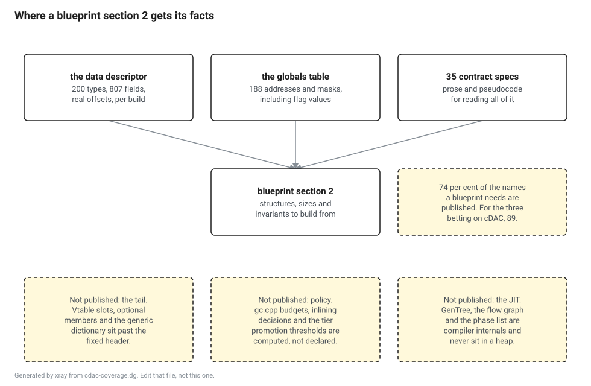

# Probe: how much of the blueprint set the data contracts actually cover

**Question.** The plan bets that roughly forty per cent of the section 2 content across the runtime side blueprints comes from cDAC data contracts. Is that bet good, and where does it fail?

**Answer. The bet was too pessimistic on breadth and says nothing about depth, which is where the real gap is.** Seventy four per cent of the structures and constants the runtime side blueprints need are published by name. For the three blueprints that explicitly bet on cDAC it is eighty nine per cent. What is published for each of those names is usually a handful of fields, not the whole structure, and the part that is missing is the same part in almost every case.

**Measured on 2 September 2026** against `dotnet/runtime` at `release/11.0`. `pin.json` still holds null commits, so this is a moving branch rather than the pin, and every number here is provisional until the pin lands on the .NET 11 tag.

## Why this was worth measuring

Twelve blueprints are supposed to be generated rather than transcribed, and the largest single source for that is the data contracts. If coverage is thin, the fallback is building the runtime with debug info and reading layouts out of DWARF and PDB, which costs about a week to set up, has to be redone per configuration, and describes one build rather than a contract. That fallback is worse in a way that matters to this project specifically: a blueprint generated from a build is a blueprint that cannot say it is generated from something the runtime promises.

The issue that raised this guessed coverage would be "method tables, modules, threads, the loader heaps and the handle table, and not much else", nearer twenty five per cent than forty. That guess is wrong, and it is wrong in an interesting direction.



## What the runtime publishes

The contract descriptor is assembled from three files, one per runtime flavour.

```
src/coreclr/vm/datadescriptor/datadescriptor.inc
src/coreclr/gc/datadescriptor/datadescriptor.inc
src/coreclr/nativeaot/Runtime/datadescriptor/datadescriptor.inc
```

Together they name 200 distinct types, 807 fields and 188 globals. Ten names appear in both the CoreCLR list and the NativeAOT list, `Thread` and `MethodTable` among them, and they are counted once. Alongside those sits `docs/design/datacontracts`, which holds 35 contract specifications in Markdown. The descriptor gives you offsets and the specification gives you the algorithm that reads them, and a blueprint section needs both.

The globals are more useful than the count suggests, because a lot of what a layout section has to state is a mask rather than a field. `SyncBlockIndexMask`, `SyncBlockIsHashCode`, `ObjectToMethodTableUnmask`, `MethodDescAlignment`, `MethodDescTokenRemainderBitCount`, `DispatchThisPtrMask` and `ArrayBaseSize` are all published, and each one is a sentence a blueprint would otherwise have to derive by reading a header and hoping.

## What the blueprints need

The needs side is [`cdac-coverage-needs.json`](cdac-coverage-needs.json), committed next to this page. It has one entry per runtime side blueprint, and each entry lists the structures and constants that blueprint's section 2 has to lay out. Thirty eight blueprints, 329 items.

That file is a judgment, not a measurement, and it is committed precisely so that it can be argued with in a diff rather than in a comment. Somebody who thinks `BP-VSD` needs eleven structures rather than eight can change the file and rerun the script, and the number moves. The join against what the runtime publishes is mechanical: a name is covered if the descriptor names it as a type or as a global, case insensitively, and every alias is printed at the end of the run so a reviewer can check the two that exist.

The file format and compiler blueprints are not in it. Their section 2 comes from ECMA-335, from `opcode.def` and from the Roslyn XML, and no data contract is expected to cover them. Two contracts, `EcmaMetadata` and `Signature`, do exist and do describe reading metadata out of a live process, which is a lesson topic rather than a blueprint source.

## The result

```
published  200 types, 807 fields, 188 globals, 35 contract specifications

all runtime side blueprints      242/329  74%
the three betting on cDAC        49/55    89%
those with no other generator    183/246  74%
```

Per blueprint, the ones at the top and the bottom are both worth looking at.

| Blueprint | Covered | Note |
|---|---|---|
| `BP-STACKWALK` | 28 of 28 | every frame kind, the transition block, the range section map and the code heap |
| `BP-METHODDESC` | 23 of 23 | including the size only entries for each method desc flavour |
| `BP-EH` | 12 of 12 | both implementations, and the native aot tracker as well |
| `BP-THREADING` | 9 of 9 | thread, thread store, thread local data and the tls index |
| `BP-ASYNC` | 5 of 5 | four months old and already fully described |
| `BP-OBJECT` | 11 of 12 | only the GC descriptor series is missing |
| `BP-METHODTABLE` | 8 of 11 | the dictionary layout, the dispatch map and the GC descriptor series are missing |
| `BP-WRITEBARRIER` | 2 of 9 | the barrier's own globals are not in the descriptor |
| `BP-VSD` | 2 of 8 | the stub kinds are not described, only the manager |
| `BP-JITIR`, `BP-INLINE`, `BP-PGO` | 0 | compiler internals, which never exist in a heap |
| `BP-HOST` | 0 of 5 | a different binary, loaded before the runtime exists |

Three of those rows contradict the project's own inventory. `BP-STACKWALK`, `BP-EH` and `BP-SUSPEND` are all marked "no" in the generation column, meaning majority hand written, and all three come out at or near full coverage for their layout section. The hand written part of those three is the algorithm, not the structures, and the inventory column conflates the two.

## The number that matters more, which is depth

Seventy four per cent is a count of names, and a name is covered if the descriptor mentions it at all. Across the 200 published types there are 807 fields, which is about four fields each. Nine types in the needs list publish no fields whatsoever.

Those nine are not a defect. `ArrayMethodDesc`, `FCallMethodDesc`, `PInvokeMethodDesc`, `EEImplMethodDesc`, `CLRToCOMCallMethodDesc`, `NonVtableSlot`, `MethodImpl`, `NativeCodeSlot` and `ObjectHandle` are published as sizes with no fields, and a size with no fields is exactly what walking a `MethodDescChunk` needs, because the walk steps by the size of the flavour it is looking at. Shallow and useless are different things.

`MethodTable` is the case to look at properly, because it is the structure the whole project leans on. Its fixed header has eleven field slots in a release build, with the three unions condensed onto one line each here:

```c++
    DWORD           m_dwFlags;
    DWORD           m_BaseSize;
    DWORD           m_dwFlags2;
    WORD            m_wNumVirtuals;
    WORD            m_wNumInterfaces;
    PTR_MethodTable m_pParentMethodTable;
    PTR_Module      m_pModule;
    PTR_MethodTableAuxiliaryData m_pAuxiliaryData;
    union { DPTR(EEClass) m_pEEClass;    TADDR m_pCanonMT; };
    union { PerInstInfo_t m_pPerInstInfo; TADDR m_ElementTypeHnd; };
    union { PTR_InterfaceInfo m_pInterfaceMap; TADDR m_encodedNullableUnboxData; };
```

The descriptor publishes ten of those eleven. The one it does not publish is the interface map, which is also one of the two the header says has to sit at a fixed offset because the JIT bakes it in. So on the fixed header, coverage is close to total.

Immediately after that block the header says this, and it is the whole finding in three comments:

```c++
    // VTable slots go here
    // Optional Members go here
    // Generic dictionary pointers go here
```

None of that is in the descriptor. The variable length tail of a method table is computed from the flags, and a reimplementer needs the computation, not an offset. The same shape holds for `MethodDescChunk`, whose header is fully published and whose payload is a run of differently sized records, and for `Object`, which publishes one field because one field is all a fixed object header has.

So the honest summary is two numbers and not one. Seventy four per cent of what a blueprint names is published. The fixed part of each published structure is nearly complete. The variable part of a structure is never published, because the descriptor describes offsets and the variable part is not at an offset.

## What is missing, in three groups

The gap list is 87 items and the script prints all of them. They sort into three groups, and the groups matter more than the count.

**The tail.** `DictionaryLayout`, `DispatchMap`, `DispatchMapEntry` and `CGCDesc`. Each of these hangs off a method table at a computed position rather than a fixed one, and each is needed by a blueprint that is otherwise well covered. `CGCDesc` is the one to be loudest about: it is the series of pointer offsets the collector reads to scan an instance, it is written backwards from the method table address, and both `BP-METHODTABLE` and `BP-OBJECT` need it. Anyone writing a collector needs it on day one.

**The policy.** `dynamic_data`, `brick_table`, `seg_mapping_table`, `alloc_list`, `mark_list`, plugs and gaps, `CallCountingInfo`, and every write barrier global. This is the group the plan already predicted, and it predicted it correctly. `gc.cpp` computes its budgets rather than declaring them, and no descriptor is going to fix that. The write barrier row is the sharpest case: `g_card_table`, `g_ephemeral_low` and `g_ephemeral_high` are values generated code has baked into it, and none of the three is in the descriptor.

**The compiler.** `GenTree`, `BasicBlock`, `Compiler`, `LclVarDsc`, the inline policy types and the PGO schema types. These are not missing, they are out of scope by construction. The JIT is a library that runs and exits, its data structures never sit in a heap somebody attaches a debugger to, and a diagnostics contract has no reason to describe them. `BP-JITIR`, `BP-INLINE` and `BP-PGO` were always going to be hand written and this measurement changes nothing about them.

`BP-HOST` at zero of five belongs in none of those groups. The host is a different binary that runs before the runtime exists, so a runtime data contract could not describe it even in principle.

## One thing worth knowing about the source

The runtime's own headers carry markers where a contract depends on a constant they define. There are nineteen in `methodtable.h` and eight in `method.hpp`, and they read like this:

```c++
    // [cDAC] [RuntimeTypeSystem]: Contract depends on the values of enum_flag3_HasStableEntryPoint,
    // enum_flag3_HasPrecode, enum_flag3_IsUnboxingStub, and enum_flag3_IsEligibleForTieredCompilation.
```

That is a stronger promise than the descriptor alone makes. A flag value with one of these next to it is a value somebody has to think about before changing, which is what makes it safe to generate a blueprint table from. It also gives the drift bot something to watch that is cheaper than diffing the whole header.

## What this decides

The forty per cent figure in the plan is too low and should be raised, with the caveat that it was measuring the wrong thing. Coverage by name is seventy four per cent. Coverage of fixed structure layout, on the structures that are published at all, is close to complete. Coverage of variable length tails is zero and will stay zero.

The DWARF and PDB fallback is not needed and should be dropped from the plan rather than kept as a hedge. Nothing in the gap list would be fixed by it except `CGCDesc` and the generic dictionary, and for those two the honest answer is a hand written subsection that says it is hand written, not a second generator with a different trust level.

`BP-METHODTABLE` keeps its "yes" mark but needs a hand written subsection covering the tail, and that subsection is the one to give the most review to, because it is the one place in that document where the generated and the typed sit side by side. `BP-OBJECT` needs the same for `CGCDesc`. `BP-METHODDESC` needs nothing added.

The generation column in the inventory should be split in two, one mark for section 2 and one for the rest of the document, because three blueprints marked hand written have a fully covered layout section and the current single column hides that.

## Rerunning it

`cdac-coverage.sh` in this directory reads the three descriptor files and the contract directory straight from GitHub, joins them against the needs file and prints the table, the depth list and the whole gap. It takes a git ref as its first argument and defaults to `release/11.0`.

```
./docs/probes/cdac-coverage.sh
./docs/probes/cdac-coverage.sh 66037f11324c2d41df6b4b92983c8bbe98d9fa78
```

It does not run the runtime and does not need an SDK, so it works on anything with bash, curl and python3. It is not run by CI, because it reads a moving branch rather than the pin. When the pin has commits in it, passing that commit makes the run reproducible, and that is the version of this measurement that should be repeated at the general availability flip.

## What this probe did not measure

Whether a published field is the field a blueprint wants. The join checks that `EEClass` is described, not that the twelve fields it describes are the twelve a section 2 would list.

Whether the 35 contract specifications are complete enough to implement from. They are prose with pseudocode in it, and the only way to find out is to write a blueprint against one and see what is missing. That is M4 work and this probe cannot substitute for it.

Whether any of this survives the pin moving. It is a branch that is still taking commits, and the whole measurement is one script run away from being redone when the pin is real.
