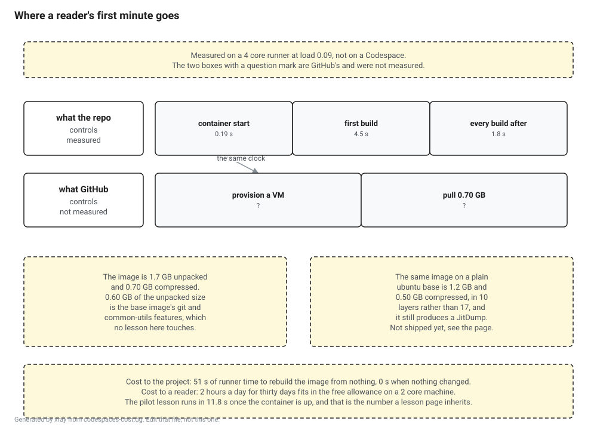

# Probe: what the E0 image costs

**Question.** What does the prebuilt Codespace cost, in cold start for a reader and in free tier hours for somebody doing a lesson a day?

**Answer. Everything this project controls is cheap, and the expensive part is not ours to measure yet.** Building the image from nothing takes 51 seconds of runner time. A reader's first command in the container takes 4.5 seconds, every one after that takes 1.8, and the pilot lesson runs in 11.8. The free allowance is 60 hours a month on the machine this devcontainer asks for, which is two hours a day. The one number the question really wanted, how long a real Codespace takes to appear, is not here, because measuring it needs a token scope this session does not have.

**Measured on 2 September 2026** on a GitHub Actions `ubuntu-latest` runner, four cores, load average 0.09, Docker 28.0.4, with SDK 10.0.400 and runtime 10.0.11. `pin.json` still holds null commits, so this is the .NET 10 substrate rather than the pin.

## The image this measures did not exist before this probe

There was no devcontainer in the repository. The plan describes E0 as a one click Codespace on a prebuilt image with the pinned SDK, the checked JIT and the analysis tools already in it, and that description was the whole specification. So the first half of this probe is `.devcontainer/Dockerfile`, and the second half is measuring it.

It is built on `mcr.microsoft.com/devcontainers/base:ubuntu-24.04` with the SDK installed by exact version rather than on a tagged .NET image, because this project pins an SDK and a tagged image gives you whichever patch was current when the tag was pushed. On top of that go lldb, the four diagnostics tools, a checked `clrjit` discovered the same way [the checked JIT probe](nightly-checked-jit.md) discovers one, and a warm NuGet cache from building the repository's own project.



## What it costs the project

```
cold build, no cache     51 s
warm rebuild, full cache  0 s
```

Regenerating the prebuild from nothing is under a minute of runner time. On a day when nothing changed it is free, because every layer hits the cache. Against the other recurring lines in the infrastructure plan this does not register, and the plan's guess of "low for the project" was right.

## What it costs a reader, in the part we control

Median of five runs each, and the runs are within one per cent of each other, which is what a quiet machine buys you.

| | Median | What it is |
|---|---|---|
| container start | 192 ms | `docker run` and nothing else |
| first command | 4522 ms | the first build in a fresh workspace |
| every command after | 1814 ms | the same command again |
| the pilot lesson | 11751 ms | `xray build lessons/m03-four-heaps` |

The first command costs two and a half seconds more than the ones after it, and that gap is the SDK's first run work, not a restore, because the image already carries a warm NuGet cache. Without that cache the first command is where a reader would sit and watch packages download.

Eleven point eight seconds for the pilot lesson is the number every lesson page inherits, and it is the one to watch as lessons get heavier.

## What it costs to download

Two different sizes, and they are three and a half times apart, so which one a sentence means has to be said.

```
unpacked, what the machine stores      1.7 GB   (base image alone: 720 MB)
compressed, what a cold start pulls    0.70 GB in 17 layers, largest 0.24 GB
```

Do not read either number off `docker image inspect`. Under the containerd snapshotter it reports the compressed total, and `docker image ls` reports whatever the storage driver thinks, which was 2.51 GB on one machine and 1.75 GB on another for the same image. The unpacked figure here is `du` inside the container and the compressed figure is read out of a real registry manifest, because that is the only place compressed sizes exist.

The layer table is the interesting part.

```
 640 MB  install the SDK
 405 MB  the base image's git feature
 242 MB  apt install lldb and friends
 195 MB  the base image's common-utils feature
 160 MB  the four dotnet diagnostics tools
```

Six hundred megabytes of a 1.7 GB image is two features of the base image, and no lesson in this book touches either of them. The git feature builds git from source. `apt install git` is a fraction of that.

## The base image is worth arguing about, and here is the second number

Rather than assert that, the same image was built again on a plain `ubuntu:24.04` with everything below the `FROM` line kept identical. That file is in the tree as `.devcontainer/Dockerfile.lean` so the comparison can be rerun rather than believed.

| | Shipping | Plain ubuntu base |
|---|---|---|
| cold build | 51 s | 44 s |
| unpacked | 1.7 GB | 1.2 GB |
| compressed | 0.70 GB | 0.50 GB |
| layers | 17 | 10 |
| `DOTNET_JitDump` works | yes | yes |

Twenty nine per cent less to download, for no measured loss of capability.

**It is not shipped, and the reason is honest rather than cautious.** Every capability check this probe can run passes on the lean image, but the check it cannot run is whether the VS Code server starts on it, and that is the one thing a Codespace has to do. The devcontainers base image exists partly to guarantee that. Swapping to a plain base on the strength of measurements that do not include the thing most likely to break is exactly the move this project tells other people not to make. The swap is worth doing and it is gated on the Codespaces test below.

## What the image can actually do

A small image that cannot run the lessons is not a cheap image, it is a wrong one, so the things it exists to provide are checked rather than assumed.

```
sdk       10.0.400
counters  10.0.731102
lldb      lldb version 18.1.3
jit       release/10.0 at d27317c6b8b1ca3833c3b2b8bb0720de36f19b75, runtime 10.0.11
dump      1 line(s) naming the method
```

The last line is the one that matters. With `DOTNET_JitName` and `DOTNET_JitDump` set and nothing installed by the reader, the runtime in the image dumps the method it was asked about. Part VI works on the image as shipped, which is the whole reason the build lesson is number 97 of 99.

## The free tier, which is arithmetic and says so

The rates below are GitHub's published ones. The only measured input is the image size.

A two core Codespace bills two core hours per wall clock hour, and the personal free allowance is 120 core hours a month. That is 60 hours on the machine this devcontainer asks for, or two hours a day for thirty days. Storage bills separately against a 15 GB month allowance, and a 1.7 GB image left alive for a whole month spends roughly a sixth of it, while a reader who deletes the codespace between sessions spends almost none.

The proposed answer on the issue guessed the free tier would cover Part I but not Part VIII. Two hours a day is a lot more room than that, and the ceiling a reader hits first is far more likely to be their own time than their allowance.

## What this probe did not measure, and it is the headline

There is no number here for how long a real Codespace takes to appear, because `gh` in this session has no `codespace` scope and creating one needs it. Everything above is the floor underneath that number and the only part of it this repository can change.

The issue set a decision rule: if cold start is over about three minutes, the local path gets promoted from equal alternative to recommended default. **That rule cannot be settled by this probe.** Container start, first build and lesson time are all measured and all small. VM provision and the 0.70 GB pull are GitHub's and are not measured. Saying the ramp is fine on the strength of the half that was easy to measure would be the same mistake as saying the browser tier works because nothing threw.

Two things are waiting on that scope. The cold start rule, and the lean base image, which cannot ship until something has proved a VS Code server starts on it.

Also not measured: prebuilds themselves. Everything here is a container built and started locally. Turning on repository prebuilds changes where the image comes from, and with prebuilds on the size mostly stops mattering for the common case and starts mattering for the fallback and for storage.

## Rerunning it

```
./docs/probes/codespaces-cost.sh
```

It wants Linux with Docker, because that is what a Codespace is, and a quiet machine if the timings are going to be quoted. That second condition is not a formality. The same script on `server3` while another job had it at load average 37 reported 7123 ms for a container start that takes 192 ms on an idle runner, which is a factor of thirty seven. None of the machines in this project's fleet is a timing environment, and the runner is used here precisely because it is a dedicated VM and the closest thing available to the two core VM a Codespace actually is.

`.github/workflows/probe-e0-image.yml` runs it on dispatch and on any change to the image or the script, so the numbers on this page regenerate when the thing they describe changes.
