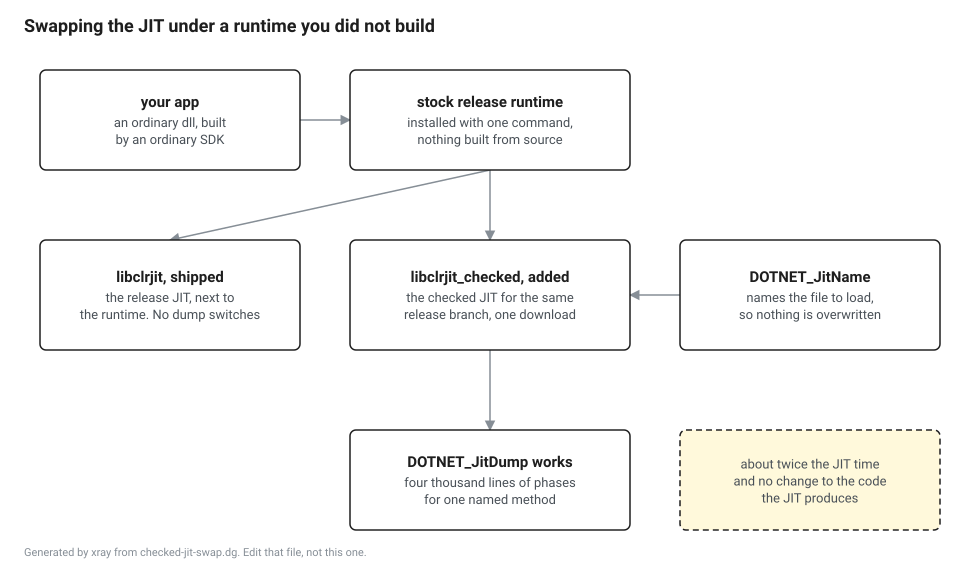

# Probe: a nightly checked JIT in a stock release runtime

**Question.** Can a nightly checked `clrjit` be dropped into a stock release runtime with `DOTNET_JitName=`, on all four platforms, so that `DOTNET_JitDump` produces a dump without anybody building the runtime?

**Answer. Yes, on all four platforms, at about twice the JIT time.** The one condition nobody wrote down in advance is that the JIT has to come from the same release branch as the runtime. A JIT from `main` is refused.

**Measured on 2 September 2026** against runtime 10.0.11, with the checked JIT from `dotnet/runtime` commit `66037f11324c2d41df6b4b92983c8bbe98d9fa78` on `release/10.0`.

## Why this was worth measuring

Eleven JIT lessons in Part VI want to show a reader the compiler's own dump of their own method. `DOTNET_JitDump` is a checked-build switch, so the shipped release JIT has nothing behind it. If getting a dump needs a runtime build, then the build lesson is not lesson 97 of 99, it is lesson 49, and every reader pays two hours and thirty gigabytes before Part VI starts.

The escape is that the JIT is a separate shared library the runtime loads by name, and the name is a knob. Upstream does something close to this for SuperPMI collections, so it works somewhere. Whether it works on four platforms with a downloaded JIT and a runtime nobody built was not known.



## Where the JIT comes from

The JIT rolling build publishes a checked `clrjit` per commit, per platform, to a public container. No account, no sign in, one file.

```
https://clrjit2.blob.core.windows.net/jitrollingbuild/builds/<commit>/<os>/<arch>/Checked/<file>
```

`<os>` is `linux`, `osx` or `windows`, `<arch>` is `x64` or `arm64`, and `<file>` is `libclrjit.so`, `libclrjit.dylib` or `clrjit.dll`. Not every commit is built, so finding one means walking recent commits on the branch and asking the container which of them it has. The container is listable, which is how the shape above was confirmed rather than guessed.

The file goes next to the runtime, under a name of its own. Nothing is overwritten, and undoing the whole thing is deleting one file.

## The results

The checked JIT loaded and `DOTNET_JitDump` produced a real dump on every one of the four. That part has no caveats.

| Platform | Machine | Loads | `JitDump` | Shipped JIT | Checked JIT | Ratio |
|---|---|---|---|---|---|---|
| win-x64 | Windows 11, bare metal, idle | yes | 3317 lines | 117 ms | 268 ms | 2.3 |
| linux-x64 | Ubuntu 24.04, bare metal, busy | yes | 4025 lines | 397 ms | 807 ms | 2.0 |
| osx-arm64 | laptop, shared with other work | yes | 4143 lines | 118 ms | 215 ms | 1.8 |
| linux-arm64 | container on that laptop | yes | 4143 lines | 114 ms | 283 ms | 2.5 |

Each number is the median of seven runs with tiered compilation and ReadyToRun both off, so the JIT compiles everything the program touches and JIT time is most of what the number contains. This is not a benchmark of the JIT. It is an answer to "will a reader notice", and the answer is that a reader notices and does not mind.

Only the Windows row was measured on a quiet machine, and it is the one worth quoting. Four separate runs of it landed on 2.3 every time, with the shipped JIT between 115 and 118 ms and the checked JIT between 268 and 274. Everything else was measured on machines doing other work, and the honest summary of those is that the ratio sat between 1.8 and 2.8 and moved around with the load. On the laptop, a run taken while its load average was above sixty gave 147 ms against 408 ms, and the shipped JIT baseline had moved as much as the checked one had, which is how you can tell the machine moved rather than the JIT.

So the claim this probe supports is "about twice the JIT time", not a figure with a decimal point in it.

The dump line counts differ across platforms because the phases that print depend on the target, which is the expected shape rather than a discrepancy. Every dump began with the method being named, and the second line of each named the target the code was for.

```
****** START compiling JitProbe.Program:Fib(int):long (MethodHash=4d3e8f17)
Generating code for Unix arm64
```

## The controls

A run that produces output is not evidence that the intended JIT produced it, so three things were checked rather than assumed.

Pointing `DOTNET_JitName` at a file that does not exist gives `Failed to load JIT compiler` and a non zero exit, on all four platforms. That is what makes the variable's effect real rather than decorative. Without this control, a run that silently ignored the variable and used the shipped JIT would look exactly like a success.

`DOTNET_JitDump` against the shipped release JIT produces nothing at all, on all four platforms. Two lines, which is the program's own output.

`DOTNET_JitDump` against the checked JIT produces thousands of lines whose first line names the method asked for. The dump is a real dump, with the IL listing, the local variable table and the phase headings, not a stub.

One thing that is easy to get wrong and cost an hour here: a method written as a local function inside top level statements is not called what you called it. The first attempt filtered on `Fib`, got an empty dump, and looked exactly like a failure of the whole idea. The method was really named `<<Main>$>g__Fib|0_0`. The probe app uses a real named method in a real class for that reason, and any lesson that asks a reader to filter a dump by method name has to say this out loud.

## The condition nobody predicted

A checked JIT from `main` dropped into a 10.0.11 runtime fails with `Failed to load JIT compiler`, exactly as if the file were missing.

That is the JIT and the runtime disagreeing about the interface between them, which is versioned and changes often on `main`. So the rule for a reader is not "download the newest checked JIT", it is "download the checked JIT built from the branch your runtime came from". A book that tells a reader to grab the latest nightly is a book whose Part VI is broken for everybody who follows it.

This has a cost that has to be stated: it couples the instruction to the pin. When the pin moves, the commit in that instruction moves with it, and a lesson that hardcodes a commit hash is a lesson that goes stale silently. The mitigation is that the hash is derived from the pin rather than typed into prose, the same as every other number here.

## The macOS question, which turned out not to be one

The prediction on the issue was that this would be awkward on macOS because of code signing, and that Part VI would end up declaring a reduced platform list.

It is not awkward. The published dylib arrives already ad-hoc signed by the linker:

```
Format=Mach-O thin (arm64)
CodeDirectory v=20400 size=47944 flags=0x20002(adhoc,linker-signed)
Signature=adhoc
```

Downloading it with `curl` sets no quarantine attribute, because quarantine is applied by the things that go through Launch Services and not by an ordinary HTTP client. The runtime loaded it with no prompt, no `spctl` argument and no `codesign` step. A reader who downloads the file through a browser instead may well meet quarantine, which is worth one sentence in the lesson and is not worth a platform list.

## What this decides

The build lesson stays at 97 of 99. Part VI keeps all four platforms and stays at the tier a reader reaches with one command. The README claim that the observation surface ships in the product now covers `JitDump` as well as `JitDisasm`, with the extra step being one download rather than a build.

## Rerunning it

`nightly-checked-jit.sh` in this directory is the Linux and macOS script, and `nightly-checked-jit.ps1` is the Windows one. Each finds a recent commit that has a build, downloads the JIT, runs the three controls, times both JITs and then deletes the file it added. Neither is run by CI, because both download a large binary from outside the pin and CI does not reach outside the pin.
