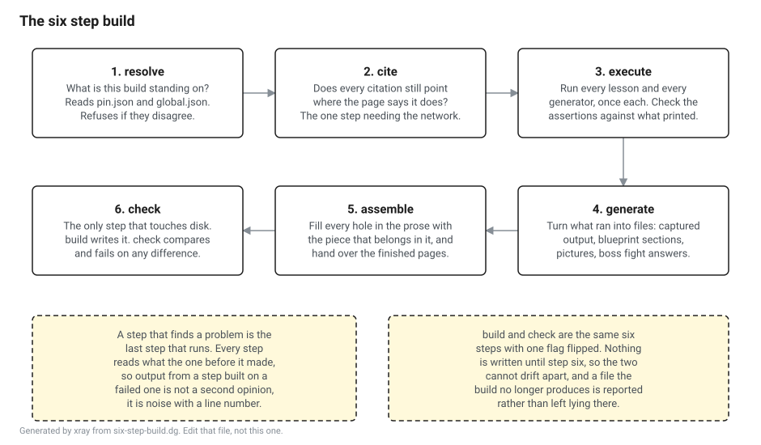

# The build

Everything in this repository that a machine produced is produced by one command, in six named steps, in the same order every time.

```
dotnet run --project tools/xray -- build
```

`build` writes what it produces. `check` does the same six steps and fails if what it produced is not what is committed. They are one code path with one flag, which is the only arrangement where the two cannot drift apart.



## Why the steps have names

A build that is one opaque operation is a build nobody can say anything true about. Something goes red, and the only information you have is that something went red.

With names the failure has a place, and the place tells you what to do. A red **execute** is a lesson whose code is wrong. A red **check** is a lesson whose code is right and whose committed page is out of date, which is a different problem with a different fix, and telling them apart takes a second rather than a bisect. A red **resolve** means the two files that say what this build is standing on are describing different worlds, and nothing below it is worth reading until that is sorted out.

The names are also a promise about ordering. The step that runs the lessons happens once, before anything is generated, so the page and the numbers underneath it can never come from two different runs of the same program.

## The six

### 1. resolve

Reads `pin.json` and `global.json`, asks the SDK which version of itself is about to compile everything, and reports the platform.

These two files are doing different jobs. `global.json` decides which compiler runs. `pin.json` decides which source tree a citation resolves against. Today they name different .NET versions on purpose, because the citations will be written against .NET 11 and the tooling still builds on 10. The moment the pin lands that gap has to close, and this step is what closes it.

What it refuses:

- No `pin.json` at the top of the repository, so nothing says what this build is pinned to.
- A second `pin.json` below the top of the repository. Two pins is the state where half the pages resolve against one commit and half against another.
- No `global.json`, or a `global.json` with no SDK version, which means two people cloning this repository can be compiling it with two different compilers.
- A pin and a `global.json` that name different SDK versions, once the pin has landed.
- Half a pin: a tag with no commit, or a commit with no tag.

### 2. cite

Takes every citation on every page apart, checks it against the pin, fetches the file from the repository it names at the commit it names, and checks the line is there and says what the page claims. The [citation format](citation-format.md) has the details.

This is the one step that needs the network, so it is also the one step with a way to turn it off. `--offline` skips it and says on the step line that it skipped it, because a check that did not run and a check that passed have to look different or the flag becomes a way of being green.

### 3. execute

Runs every lesson and every blueprint generator, once each. One process per lesson, because a lesson is a sequence where the third block depends on what the first one allocated.

Everything checked here is a fact about the run rather than about a file. Each block reached its marker, so it actually ran. What it printed holds every assertion made about it. None of what it printed carries a path off the machine that produced it. A boss fight's starting file loses to its own grader, so the fight is a fight.

### 4. generate

Turns what ran into content. Captured output, one file per block the page is allowed to quote. Blueprint sections, one file each. Pictures, an SVG and an Excalidraw scene per diagram source. A boss fight's answer file.

### 5. assemble

Fills every hole in the prose with the piece that belongs in it, and produces the finished pages. The [lesson format](lesson-format.md) lists the kinds of hole.

### 6. check

The only step that touches the disk. Everything the five steps above produced arrives here as a list of files and their contents, and this step either writes them or compares them and reports every difference.

It also reports files nothing produces any more. Rename a block and its old captured output stays on disk forever, unread and uncompared, and the next person to open the directory finds two files where one of them is the truth. `build` deletes those, `check` names them. Only directories this build put something into are swept, so a lesson that has never been built is not accused of having leftovers.

## A step that finds a problem is the last step that runs

This is not tidiness. Every step reads what the step before it produced, so the output of a step running on top of a failed one is not a second opinion, it is noise with a line number in it. A lesson whose code did not run has no captured output, and the page assembled around the hole where that output should be would report a second failure that is the first one wearing a hat.

Inside a step it works the other way. All the lessons execute even after the first one fails, because those really are independent, and finding out about three broken lessons in one run is worth a longer log.

## What it looks like

```
  resolve   .NET 10.0.11 on osx-arm64, SDK 10.0.400, pin.json holds no version yet so no citation resolves
  cite      none yet, because pin.json holds a null commit and a citation without one is not accepted
  execute   2 lesson(s) and 1 blueprint(s), 18 block(s) run, 8 assertion(s) held
  generate  13 diagram(s), 9 captured output(s), 2 generated section(s)
  assemble  3 page(s)
  check     42 file(s), and what is committed is what the code produces
xray check: 0 problem(s)
```

Every one of those numbers is worth reading. Zero assertions held would mean the assertion checker is running and checking nothing. Zero citations is the honest count today and would be a lie the day after the pin lands.

## Proving the last step works

Two of the claims this repository rests on are that no number in a lesson is typed by a person and that no table in a blueprint is transcribed by one. Both are enforced by step six comparing a regenerated file against a committed one, so both are exactly as true as that comparison is.

```
dotnet run --project tools/xray -- check --selftest
```

This copies a real lesson and a real blueprint, breaks each copy in one specific way, and requires the ordinary check to object by name. It bumps a digit in a captured output, deletes one, appends a sentence to a generated page, leaves a file behind that no block produces, and takes away the pin. Two of its cases change nothing and have to pass, because without them a harness that failed on everything would report a clean sweep. It runs in CI as the `tamper` job.

## Pointing it somewhere smaller

Every command takes a path and defaults to the whole repository.

```
dotnet run --project tools/xray -- check lessons/m03-four-heaps
dotnet run --project tools/xray -- build docs
```

The path narrows what is executed, generated and assembled. It does not narrow what the resolve step reads, because the pin belongs to the repository rather than to whichever directory you happened to name.
