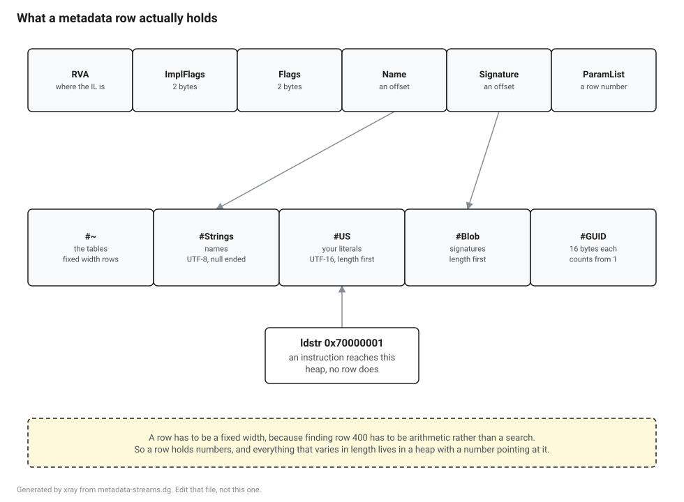
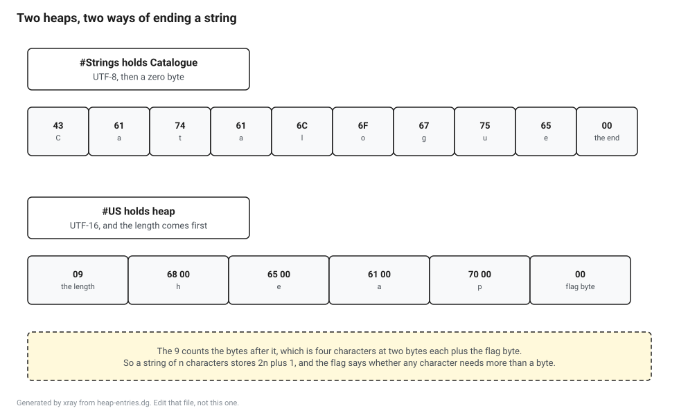

<!-- Generated by xray from lesson.src.md and lesson.cs. Do not edit this file, edit those two and run: dotnet run --project tools/xray -- build lessons -->

# The four heaps

Where do the strings and the blobs live?

You have seen the metadata tables. A type is a row, a method is a row, a parameter is a row, and every row has a fixed set of columns. What you have not seen is where the actual text goes, because a row cannot hold text. This lesson is about the four places it goes instead, and about the fact that two of those places both hold strings and are not the same place.

This lesson runs on the stock SDK. Nothing to install beyond the one in the README.

There is no debugger here and no privilege you do not already have. `System.Reflection.Metadata` ships in the box.

## A row cannot hold a name

A metadata table is an array of rows and every row in one table is the same width. That is not a style choice. Finding row four hundred has to be one multiplication and one addition, because a metadata reader does that millions of times during a startup and cannot afford to walk from the beginning counting.

A fixed width row cannot contain a name, because names are not all the same length. So the row contains a number, and the number is an offset into a byte array that sits elsewhere in the file. Those byte arrays are the heaps.



There are five streams in a metadata section and four of them are heaps. `#~` holds the tables. `#Strings` holds names. `#US` holds the string literals from your program. `#Blob` holds signatures and anything else that is a length prefixed run of bytes. `#GUID` holds sixteen byte values, and in practice holds exactly one.

Here is the fixture assembly, opened.

```csharp
using System.Reflection.Metadata;
using System.Reflection.Metadata.Ecma335;
using System.Reflection.PortableExecutable;
using System.Text;
```

```csharp
// The build says which directory this lesson is in. It has to, because dotnet run does not
// promise the working directory of a file you point it at. Run this by hand from the lesson
// directory and the dot is the same answer.
var here = Environment.GetEnvironmentVariable("XRAY_HERE") ?? ".";

// The fixture is built before this runs, so there is exactly one Sample.dll under it.
var file = Directory.GetFiles(Path.Combine(here, "fixture", "bin", "Release"), "Sample.dll", SearchOption.AllDirectories)[0];

using var stream = File.OpenRead(file);
using var image = new PEReader(stream);

// Two views of the same bytes. The reader is the polite one. The byte array is the whole metadata
// section, and every offset in this lesson is an index into it.
var reader = image.GetMetadataReader();
var metadata = image.GetMetadata().GetContent();

Console.WriteLine($"metadata version: {reader.MetadataVersion}");
Console.WriteLine($"type definitions: {reader.TypeDefinitions.Count}");

foreach (var handle in reader.TypeDefinitions)
{
    var type = reader.GetTypeDefinition(handle);
    var space = reader.GetString(type.Namespace);
    Console.WriteLine($"  {(space.Length == 0 ? string.Empty : space + ".")}{reader.GetString(type.Name)}");
}
```

```text
metadata version: v4.0.30319
type definitions: 3
  <Module>
  Sample.Catalogue
  Sample.Shelf
```

The metadata version string is worth a moment. It says `v4.0.30319`, which is the build number of .NET Framework 4.0, released in 2010. Every .NET assembly ever produced since then says that, including the one you built ten seconds ago on .NET 10. It is a version number that stopped meaning anything and stayed anyway, because too much code compares it against that exact string. <!-- literal: product versions and the year one of them shipped, neither of which this lesson measured -->

## Where the heaps are, and why that is not on this page

Each heap has a position in the metadata section and a length.

```csharp
foreach (var heap in Enum.GetValues<HeapIndex>())
{
    Console.WriteLine($"{heap,-10} starts at {reader.GetHeapMetadataOffset(heap),5} and runs for {reader.GetHeapSize(heap),5} bytes");
}
```

Those numbers are positions in a file the compiler wrote, and they move when the compiler moves. A newer Roslyn that emits one more attribute makes every one of them different. Nothing would be learned by pinning them, and the build would break every time the SDK moved, which is the sort of red build that teaches people to ignore red builds. So the block is marked `capture=drop` and this page cannot show you what it printed.

That does not mean nothing is checked. It means the checking moves from the numbers to the shape.

**Checked, though the output is not on this page.** That block prints something different on every machine, so nothing is stored and nothing can be quoted. These are the things that are true of it everywhere, and the build fails on any platform where one of them stops being true.

- Exactly 4 lines. Four heaps, one line each. The tables stream is not among them, because it is a stream and not a heap, and a reader counting streams on this page will get five.
- A line matches `^Guid .* runs for +16 bytes$`. Every entry in this heap is sixteen bytes wide and this assembly has one entry, so this is the one number in the block that does not move when the compiler moves.
- A line matches `^String +starts at +[0-9]+ and runs for +[1-9][0-9]* bytes$`. The strings heap is never empty in an assembly that defines a type, because a type with no name is not something this format can represent. The size itself changes with every compiler release, so the rule says it is not zero and says nothing else about it.

Read the middle one again, because it is the interesting one. It pins the size of `#GUID` and says nothing whatever about the other three, which is the shape of most honest claims about a file format: one part is fixed by the specification and the rest is up to whoever wrote the compiler that day.

## A name is an offset, and you can go and look

Take the type `Sample.Catalogue`. Its row has a `Name` column, and the value in that column is not the text `Catalogue`. It is a number. Here is that number used the hard way, by walking into the byte array ourselves and reading until the terminator.

```csharp
var catalogue = reader.TypeDefinitions
    .Select(reader.GetTypeDefinition)
    .First(type => reader.GetString(type.Name) == "Catalogue");

var stringsStart = reader.GetHeapMetadataOffset(HeapIndex.String);
var stringsSize = reader.GetHeapSize(HeapIndex.String);

// The row gave us a number. Everything from here is us, walking the bytes by hand.
var nameOffset = MetadataTokens.GetHeapOffset(catalogue.Name);
var end = nameOffset;
while (metadata[stringsStart + end] != 0)
{
    end++;
}

var raw = metadata.AsSpan(stringsStart + nameOffset, end - nameOffset).ToArray();

Console.WriteLine($"bytes at that offset: {Convert.ToHexString(raw)}");
Console.WriteLine($"the byte after them:  {metadata[stringsStart + end]:X2}");
Console.WriteLine($"decoded as UTF-8:     {Encoding.UTF8.GetString(raw)}");
Console.WriteLine($"and the reader says:  {reader.GetString(catalogue.Name)}");
```

```text
bytes at that offset: 436174616C6F677565
the byte after them:  00
decoded as UTF-8:     Catalogue
and the reader says:  Catalogue
```

Nine bytes of UTF-8, then a zero. Read that hex two characters at a time and the first three pairs are `C`, `a` and `t`, one byte each, because every character in this name happens to be ASCII. The reader agrees with us because the reader is doing the same thing with better error handling.



That is the whole of `#Strings`. It is one long byte array of UTF-8 strings, each ended by a zero byte, and an offset into it is an index into that array. The first byte is a zero, so an offset of zero means the empty string, which is how a row says it has no name.

**Predict before you run it.** The fixture has a property called Greeting, and the compiler generated a getter for it called get_Greeting. What is in #Strings?

- **A.** Two entries. Greeting is not get_Greeting, so both get written.
- **B.** One entry, get_Greeting, and the property's name is an offset four bytes into it.
- **C.** One entry, Greeting, and the getter name is built at runtime by putting get_ in front of it.

<details>
<summary>Show the answer once you have picked one</summary>

**A is wrong.** This is the answer deduplication predicts, because the two names are not equal. It is still not what happens, and the reason is in the next option.

**B is right.** The heap is a byte array of null terminated strings, and a name is an offset into it. Nothing says an offset has to be the start of a string somebody wrote. Start reading four bytes in and you get Greeting, terminated by the same null byte, for free. The writer sorts names by their reversed text so it can spot exactly this.

**C is wrong.** Nothing in the metadata format builds a name at runtime. The method table row has to hold an offset to the full name, because a reader has to be able to look up get_Greeting without knowing that a property exists.

This is worth holding on to because it explains a class of confusing sight. A name in #Strings can start in the middle of another name, so a program that walks the heap from the start and stops at every null byte does not see every name in it. It sees a subset, and the entries it misses are the shared tails.

</details>

```csharp
var greeting = reader.PropertyDefinitions
    .Select(reader.GetPropertyDefinition)
    .First(property => reader.GetString(property.Name) == "Greeting");

var getter = reader.MethodDefinitions
    .Select(reader.GetMethodDefinition)
    .First(method => reader.GetString(method.Name) == "get_Greeting");

var propertyAt = MetadataTokens.GetHeapOffset(greeting.Name);
var methodAt = MetadataTokens.GetHeapOffset(getter.Name);

Console.WriteLine($"the two offsets differ by {propertyAt - methodAt}");
Console.WriteLine($"bytes at the method's offset:   {Convert.ToHexString(Tail(methodAt))}");
Console.WriteLine($"bytes at the property's offset: {Convert.ToHexString(Tail(propertyAt))}");

byte[] Tail(int offset)
{
    var stop = offset;
    while (metadata[stringsStart + stop] != 0)
    {
        stop++;
    }

    return metadata.AsSpan(stringsStart + offset, stop - offset + 1).ToArray();
}
```

```text
the two offsets differ by 4
bytes at the method's offset:   6765745F4772656574696E6700
bytes at the property's offset: 4772656574696E6700
```

Four bytes apart, and the second run of bytes is the tail of the first one. There is one string in the heap and two names pointing into it, one at the start and one four bytes in. The compiler sorts the names it is about to write by their reversed text, which puts every name next to the names that end the same way, and then it can spot that `Greeting` is already present as the tail of `get_Greeting`.

This is worth carrying with you for the rest of Part II. A name in `#Strings` can begin in the middle of another name, so a program that walks the heap from the start and cuts at every zero byte does not see every name that is in there. It sees a subset. The names it misses are exactly the shared tails, which for a typical assembly means most of the property and event names.

## Your string literals are somewhere else entirely

This is the part that surprises people. `#Strings` holds names. The literals you wrote in your code are not names, and they are in a different heap, `#US`, in a different encoding, with a different way of saying where a string stops.

**Predict before you run it.** The fixture writes the literal "the quick brown fox" twice, in two different methods. How many entries does the #US heap have for it?

- **A.** Two. Each ldstr instruction needs its own entry to point at.
- **B.** One. The text is stored once and both instructions carry the same offset.
- **C.** One, because the compiler rewrote the second method to call the first.

<details>
<summary>Show the answer once you have picked one</summary>

**A is wrong.** Two instructions do point at it, and they point at the same place. An entry is a piece of storage, and nothing about the format says a piece of storage may only be named once.

**B is right.** The writer keeps a map from text it has already written to the offset it wrote it at, and the second ldstr gets the offset back rather than a new one. This is why the two strings are reference equal at runtime, which is a fact most C# developers know as a rule and have never seen a reason for.

**C is wrong.** The compiler did not touch the methods. Deduplication happens in the writer, at the point of putting bytes into a heap, and it has no opinion about the code that will point at them.

The same deduplication happens in #Strings and in #Blob, and you will see the blob one later in this lesson. What does not happen is deduplication across heaps, because they are separate byte arrays with separate offsets and nothing in the format connects them.

</details>

```csharp
var userStart = reader.GetHeapMetadataOffset(HeapIndex.UserString);
var userSize = reader.GetHeapSize(HeapIndex.UserString);

// The heap opens with a single zero byte, so an offset of zero can mean "there is no string here".
// Every entry after that is a length, then that many bytes, and the last of them is a flag.
//
// The length is a compressed integer, and this walk pretends it is always one byte. That is true
// for every string in this assembly and it is not true in general. Making it true in general is
// the boss fight.
var at = 1;
while (at < userSize)
{
    var length = metadata[userStart + at];

    // The heap is padded up to a four byte boundary with zeros, so a length of zero is the end of
    // the strings and the start of the padding. Miss this and the walk runs off into it.
    if (length == 0)
    {
        break;
    }

    var text = Encoding.Unicode.GetString(metadata.AsSpan(userStart + at + 1, length - 1).ToArray());
    var flag = metadata[userStart + at + length];

    Console.WriteLine($"{length,3} bytes, {text.Length,2} characters, flag {flag}: {text}");
    at += 1 + length;
}
```

```text
 39 bytes, 19 characters, flag 0: the quick brown fox
 11 bytes,  5 characters, flag 0: II.24
  9 bytes,  4 characters, flag 0: heap
```

Read the first line as arithmetic. `the quick brown fox` is nineteen characters. UTF-16 stores each of them in two bytes, which is thirty eight. The stored length is thirty nine, and the extra byte is a flag on the end.

The flag is one when any character in the string needs more than the bottom seven bits, and zero otherwise. It exists so that a reader deciding whether a string is plain ASCII does not have to look at the string. It is a single byte answering a question that would otherwise cost a scan, and it is the sort of thing you find all through this format once you start looking.

And the literal written twice appears once, which is the answer to the gate above. That is also the reason two identical literals in your program are reference equal at runtime. Most C# developers know that as a rule and have never seen why.

The two heaps really are separate. Nothing is shared between them, not even a string that appears in both.

```csharp
var names = metadata.AsSpan(stringsStart, stringsSize);
var literals = metadata.AsSpan(userStart, userSize);

var literalUtf8 = Encoding.UTF8.GetBytes("the quick brown fox");
var literalUtf16 = Encoding.Unicode.GetBytes("the quick brown fox");
var nameUtf8 = Encoding.UTF8.GetBytes("Catalogue");
var nameUtf16 = Encoding.Unicode.GetBytes("Catalogue");

Console.WriteLine($"the literal, as UTF-8, inside #Strings:   {names.IndexOf(literalUtf8) >= 0}");
Console.WriteLine($"the literal, as UTF-16, inside #US:       {literals.IndexOf(literalUtf16) >= 0}");
Console.WriteLine($"the type name, as UTF-8, inside #Strings: {names.IndexOf(nameUtf8) >= 0}");
Console.WriteLine($"the type name, as UTF-16, inside #US:     {literals.IndexOf(nameUtf16) >= 0}");
```

```text
the literal, as UTF-8, inside #Strings:   False
the literal, as UTF-16, inside #US:       True
the type name, as UTF-8, inside #Strings: True
the type name, as UTF-16, inside #US:     False
```

Four searches over raw bytes. The literal is in `#US` and not in `#Strings`. The type name is in `#Strings` and not in `#US`. They are separate byte arrays with separate offsets, and nothing in the format connects them.

## #Blob, which is everything else that varies

A signature is not text, and it does not go in either string heap. It goes in `#Blob`, which holds length prefixed runs of bytes: signatures, constant values, custom attribute arguments, public keys, and marshalling descriptors.

```csharp
var count = reader.MethodDefinitions
    .Select(reader.GetMethodDefinition)
    .First(method => reader.GetString(method.Name) == "Count");

var signature = reader.GetBlobBytes(count.Signature);

Console.WriteLine($"int Count(string, int) is {signature.Length} bytes: {Convert.ToHexString(signature)}");
Console.WriteLine($"  {signature[0]:X2}  calling convention, the 0x20 bit is HASTHIS");
Console.WriteLine($"  {signature[1]:X2}  parameter count");
Console.WriteLine($"  {signature[2]:X2}  return type, ELEMENT_TYPE_I4");
Console.WriteLine($"  {signature[3]:X2}  first parameter, ELEMENT_TYPE_STRING");
Console.WriteLine($"  {signature[4]:X2}  second parameter, ELEMENT_TYPE_I4");

// Three property getters, three different names, one shape. The blob heap stores the shape once.
var getters = new[] { "get_Greeting", "get_Section", "get_Label" };
var shapes = getters
    .Select(name => reader.MethodDefinitions.Select(reader.GetMethodDefinition).First(method => reader.GetString(method.Name) == name))
    .Select(method => MetadataTokens.GetHeapOffset(method.Signature))
    .Distinct()
    .Count();

Console.WriteLine($"{getters.Length} getters, {shapes} signature blob between them");
```

```text
int Count(string, int) is 5 bytes: 2002080E08
  20  calling convention, the 0x20 bit is HASTHIS
  02  parameter count
  08  return type, ELEMENT_TYPE_I4
  0E  first parameter, ELEMENT_TYPE_STRING
  08  second parameter, ELEMENT_TYPE_I4
3 getters, 1 signature blob between them
```

Five bytes for a whole method signature. That is worth sitting with. `int Count(string, int)` is a return type, two parameter types and the knowledge that it is an instance method, and the entire thing costs five bytes because every part of it is a number from a fixed table rather than a name.

The last line is the same deduplication you saw in `#US`, doing something more useful. Three property getters with three different names all have the shape "instance method, no parameters, returns String", and the heap stores that shape once. In a real assembly with hundreds of properties, that is hundreds of pointers at one blob.

Signatures get a lesson of their own, M05, which is also where the ECMA drift ledger first appears, because the signature grammar is one of the things the augments document actually changed.

## #GUID, the small one

```csharp
var guidSize = reader.GetHeapSize(HeapIndex.Guid);
var module = reader.GetModuleDefinition();

Console.WriteLine($"#GUID holds {guidSize} bytes, so {guidSize / 16} entry of 16");
Console.WriteLine($"the module's Mvid is entry number {MetadataTokens.GetHeapOffset(module.Mvid)}, and this heap counts from 1");
Console.WriteLine($"entry 0 is not a GUID, it is how a row says it has none");
```

```text
#GUID holds 16 bytes, so 1 entry of 16
the module's Mvid is entry number 1, and this heap counts from 1
entry 0 is not a GUID, it is how a row says it has none
```

`#GUID` is an array of sixteen byte values with no length prefix and no terminator, because every entry is the same size. It is the only heap indexed by entry number rather than by byte offset, and it counts from one, so a row holding zero is a row saying it has no GUID.

Almost every assembly has exactly one entry, the module version id. The Mvid is a fresh value for every distinct build, which is what makes it useful for matching an assembly to its PDB and useless as anything you could put on this page.

```csharp
Console.WriteLine(reader.GetGuid(module.Mvid));
```

That is marked `capture=drop` for the reason that is now familiar. Run it twice against two builds and you get two different values, which is the point of it. What survives from one build to the next is the shape, so the shape is what gets checked.

**Checked, though the output is not on this page.** That block prints something different on every machine, so nothing is stored and nothing can be quoted. These are the things that are true of it everywhere, and the build fails on any platform where one of them stops being true.

- Exactly one line. One module version id, because the heap it comes out of has one entry in it.
- A line matches `^[0-9a-f]{8}-[0-9a-f]{4}-[0-9a-f]{4}-[0-9a-f]{4}-[0-9a-f]{12}$`. The value is different in every build and its shape is the same in all of them. That shape is the most a page can honestly say about a number whose entire job is to be new every time.

## What to take away

A row is fixed width, so anything of variable length is an offset and the thing itself is in a heap.

There are two heaps holding strings and they are not interchangeable. `#Strings` holds names, in UTF-8, ended by a zero byte. `#US` holds your literals, in UTF-16, with the length in front and a flag on the end.

Every heap deduplicates, and `#Strings` goes further and shares tails, so walking it from the front does not enumerate it.

`#Blob` holds anything else that is a run of bytes, and a whole method signature fits in five of them.

`#GUID` counts from one, and entry zero means none.

## Boss fight: Walk the user string heap properly

The walk in the lesson cheated. It read every length prefix as a single byte, which is true for every string in this assembly and false in general. A length in a heap is a compressed unsigned integer: one byte, two bytes or four, and the top bits of the first byte say which. The rule is in ECMA-335 II.23.2 and it is four lines long. Write it, walk #US with it, and answer the three questions below. Your answers are about the fixture assembly next door, so they are the same numbers whether you cheat or not, and the point is the code that got you there.

- **count** How many strings are in the #US heap?
- **longest** Which of them is the longest, in characters?
- **bytes** How many bytes does that longest entry take up in the heap, counting its length prefix and its trailing flag byte?

Open `boss/boss.cs`, fill in the parts marked as yours, and run this until it stops complaining.

```
dotnet run --project tools/xray -- boss lessons/m03-four-heaps
```

The grader names the answer that is wrong and shows you what you printed. It does not tell you what the answer is. The worked solution is in the same directory, and reading it is allowed and is a worse way to learn this.

## Sources

ECMA-335, 6th edition, June 2012. <!-- literal: the edition and the month it was published -->

II.24.2.1 for the metadata root, II.24.2.2 for the stream headers, II.24.2.3 for `#Strings`, II.24.2.4 for `#US` and `#Blob` including the flag byte on the end of a user string, II.24.2.5 for `#GUID`, and II.24.2.6 for `#~`.

II.23.2 for compressed integers, which is the four line rule the boss fight is about.

II.22 for the table layouts, and II.23.2.1 for the method signature decoded above.

There are no `runtime:` citations in this lesson, because the runtime pin in `pin.json` has not landed yet and a citation without a commit is one this repository does not accept. The claims above are claims about the format and are checkable against the standard and against the output on this page. When the pin lands, the reader side of this in `src/coreclr/md/` gets cited here properly.
