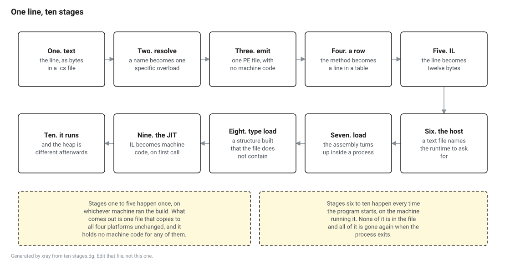

<!-- Generated by xray from lesson.src.md and lesson.cs. Do not edit this file, edit those two and run: dotnet run --project tools/xray -- build lessons -->

# One line, ten stages

One line of C#, followed all the way down.

This is the first lesson of the tour, and the tour is one pass over the whole runtime at low resolution. Everything here gets its own chapter later. The point of doing it once quickly first is that the later chapters make a lot more sense when you already know roughly where they sit.

We are going to take a single line of C#, the shortest useful one I could think of, and watch what happens to it. It is this.

```csharp
public static int Count(string line) => line.Split(' ').Length;
```

Ten things happen to that line between you typing it and a processor doing anything about it. Five of them happen on the machine that runs the build, and they happen once. The other five happen on the machine that runs the program, and they happen every time it starts. Almost everything people find confusing about .NET lives in the gap between those two halves.

This lesson runs on the stock SDK. Nothing to install beyond the one in the README.

Nothing in this lesson needs a debugger, a build of the runtime, or a privilege you do not already have. It is all done with `System.Reflection.Metadata` and `System.Reflection`, both of which ship in the box.



## Stage one. It is text

Before anything else, the line is bytes in a file. That sounds too obvious to say, but it is worth saying once, because it is the last point at which the thing you wrote and the thing on disk are the same thing.

```csharp
using System.Diagnostics;
using System.Reflection;
using System.Reflection.Metadata;
using System.Reflection.Metadata.Ecma335;
using System.Reflection.PortableExecutable;
using System.Runtime.InteropServices;
using System.Text;
```

```csharp
// The build says which directory this lesson is in. It has to, because dotnet run does not
// promise the working directory of a file you point it at. Run this by hand from the lesson
// directory and the dot is the same answer.
var here = Environment.GetEnvironmentVariable("XRAY_HERE") ?? ".";

var sourceFile = Path.Combine(here, "fixture", "Sample.cs");
var line = File.ReadAllLines(sourceFile).First(text => text.Contains("Count(string line)", StringComparison.Ordinal)).Trim();

Console.WriteLine(line);
Console.WriteLine($"{Encoding.UTF8.GetByteCount(line)} bytes of UTF-8, and nothing else");
```

```text
public static int Count(string line) => line.Split(' ').Length;
63 bytes of UTF-8, and nothing else
```

That is the entire input to everything below. The compiler reads those bytes and never looks at them again, and no part of what follows can recover them. The line is not stored anywhere in what comes out of the build. What is stored is what the compiler concluded from it, which is a different thing, and the rest of this lesson is mostly about how different.

## Stage two. A name becomes one specific method

`line.Split(' ')` is a name and an argument. There are several methods called `Split` on `String`, and picking which one you meant is a job with rules that take a chapter of the language specification to state. That job happens once, at build time, and the answer is written down.

Here is the answer, read back out of the file.

```csharp
var built = Path.Combine(here, "fixture", "bin", "Release");
var assemblyFile = Directory.GetFiles(built, "Sample.dll", SearchOption.AllDirectories)[0];
var output = Path.GetDirectoryName(assemblyFile)!;

using var stream = File.OpenRead(assemblyFile);
using var image = new PEReader(stream);
var reader = image.GetMetadataReader();
```

```csharp
var count = reader.MethodDefinitions
    .Select(reader.GetMethodDefinition)
    .First(method => reader.GetString(method.Name) == "Count");

var body = image.GetMethodBody(count.RelativeVirtualAddress);
var il = body.GetILBytes()!;

// The call instruction is 0x6F, and the four bytes after it are a metadata token naming what is
// being called. Finding it this way rather than by counting is the point: the token is in the
// bytes, so nobody has to be trusted about it.
var callAt = Array.IndexOf(il, (byte)0x6F);
var token = BitConverter.ToInt32(il, callAt + 1);
var target = reader.GetMemberReference((MemberReferenceHandle)MetadataTokens.Handle(token));
var owner = reader.GetTypeReference((TypeReferenceHandle)target.Parent);

// A method signature blob opens with a calling convention byte and then the number of parameters.
var signature = reader.GetBlobReader(target.Signature);
signature.ReadByte();
var parameters = signature.ReadCompressedInteger();

Console.WriteLine($"the call goes to {reader.GetString(owner.Namespace)}.{reader.GetString(owner.Name)}.{reader.GetString(target.Name)}");
Console.WriteLine($"which takes {parameters} arguments, and the source passed 1");
```

```text
the call goes to System.String.Split
which takes 2 arguments, and the source passed 1
```

The source passed one argument and the call passes two. That is not a mistake in either place.

**Predict before you run it.** The line calls line.Split(' ') and passes one argument. How many arguments does the call instruction in the IL pass?

- **A.** One. The compiler writes down what you wrote.
- **B.** Two. The overload takes a second argument with a default, and the default is filled in here rather than at run time.
- **C.** Two, and the second one is the array that Split will fill in.

<details>
<summary>Show the answer once you have picked one</summary>

**A is wrong.** The compiler writes down what it resolved, which is not always what you wrote. There is no method on String that takes one char and nothing else, so a call passing one argument would have nothing to point at.

**B is right.** Split(char, StringSplitOptions) has a default of StringSplitOptions.None on the second parameter. A default argument in C# is not stored anywhere in the compiled call. The compiler looks it up at the call site and writes the value into the instruction stream, which is why changing a default in a library does nothing to code that was already compiled against it.

**C is wrong.** Split returns its array rather than being handed one. The second argument is a set of options, and you can see it in the IL as ldc.i4.0, which pushes zero, which is StringSplitOptions.None.

That last part is worth keeping. A default argument is baked into the caller, so a library that changes one has not changed the behaviour of anything already built against it. The same is true of a const field and it is not true of a static readonly field, and the difference between those two is a thing that has cost people days.

</details>

Everything about that resolution is now frozen. If somebody ships a new version of the library tomorrow with a better overload of `Split`, this file goes on calling the one that was picked today, until somebody rebuilds it. Overload resolution is a build time act with a build time answer, and that is true of a great deal that people assume is decided later.

## Stage three. It becomes a Windows executable, whatever machine you are on

The compiler produces a file. The format of that file is the Portable Executable format, which is the Windows executable format, and it is that on Linux and on macOS too.

```csharp
var headers = image.PEHeaders;
var firstTwo = File.ReadAllBytes(assemblyFile).AsSpan(0, 2).ToArray();

Console.WriteLine($"first two bytes:       {Encoding.ASCII.GetString(firstTwo)}");
Console.WriteLine($"machine in the header: {headers.CoffHeader.Machine}");
Console.WriteLine($"sections:              {string.Join(", ", headers.SectionHeaders.Select(section => section.Name))}");
Console.WriteLine($"managed header says:   {headers.CorHeader!.Flags}");
Console.WriteLine($"precompiled code:      {headers.CorHeader.ManagedNativeHeaderDirectory.Size} bytes");
```

```text
first two bytes:       MZ
machine in the header: I386
sections:              .text, .rsrc, .reloc
managed header says:   ILOnly
precompiled code:      0 bytes
```

Every line of that is worth a second look.

The file opens with the two bytes `MZ`. Those are the initials of Mark Zbikowski, who worked on MS-DOS in the early eighties, and they are followed by a tiny MS-DOS program that prints a message saying this program cannot be run in DOS. Your .NET assembly, on your Linux server, in a container, contains an MS-DOS program. Nothing has run it in thirty years.

The header has a field saying which processor the code is for.

**Predict before you run it.** The fixture was built on whichever machine produced this page, and one of those is an Apple laptop with an ARM chip in it. What does the CPU field in the header of Sample.dll say?

- **A.** ARM64, because that is the machine it was built on.
- **B.** I386, meaning a thirty two bit Intel processor from the 1980s.
- **C.** Nothing. The field is zero, because the file has no machine code in it.

<details>
<summary>Show the answer once you have picked one</summary>

**A is wrong.** Nothing about the build depends on the machine it ran on. The same source produces the same bytes on all four platforms, which is a property the build here checks on every change, and a CPU name in the header would make that impossible.

**B is right.** There is a flag elsewhere in the header saying the file contains no machine code at all, and once that flag is set the CPU field means nothing. It says I386 because that is what the very first version of this format wrote there and no loader has cared since. It is a field that stopped meaning anything and stayed.

**C is wrong.** That would be the sensible design and it is not the one we have. Zero in that field means unknown, and old loaders refused files that said unknown, so the value that means nothing here is the value that used to mean something.

The whole header is like this once you start reading it. Fields that meant something on one operating system in one decade, still being written by a compiler that targets none of it, because a reader somewhere might check. The rule for reading this format is that a value is only worth believing once you know which flag says whether anyone looks at it.

</details>

The flag that makes the processor field meaningless is on the fourth line, `ILOnly`, and the line under it is the other half of the same statement. There is a directory in the header reserved for precompiled machine code, and its size is zero. There is no machine code in this file for any processor. Copy it to a machine with a completely different instruction set and it works, because there was never anything in it that depended on the instruction set in the first place.

## Stage four. The method becomes a row in a table

Inside the file, past the headers, is a set of tables. Not a tree, not a stream of records, tables, with fixed width rows and columns. Every type is a row, every method is a row, every parameter is a row.

```csharp
var countHandle = reader.MethodDefinitions
    .First(handle => reader.GetString(reader.GetMethodDefinition(handle).Name) == "Count");

var declaring = reader.GetTypeDefinition(reader.GetMethodDefinition(countHandle).GetDeclaringType());

Console.WriteLine($"token:          0x{MetadataTokens.GetToken(countHandle):X8}");
Console.WriteLine($"top byte:       0x{MetadataTokens.GetToken(countHandle) >> 24:X2}, which is the MethodDef table");
Console.WriteLine($"row number:     {MetadataTokens.GetToken(countHandle) & 0xFFFFFF}");
Console.WriteLine($"declaring type: {reader.GetString(declaring.Namespace)}.{reader.GetString(declaring.Name)}");
Console.WriteLine($"name:           {reader.GetString(count.Name)}");
Console.WriteLine($"attributes:     {count.Attributes}");
Console.WriteLine($"the row holds no code of its own, only the address of some");
```

```text
token:          0x06000001
top byte:       0x06, which is the MethodDef table
row number:     1
declaring type: Sample.Text
name:           Count
attributes:     Public, Static, HideBySig
the row holds no code of its own, only the address of some
```

The number at the top is a metadata token, and the way to read it is to split it in two. The top byte says which table, the bottom three bytes say which row. So a token is nothing more exotic than a table number and a row number packed into a machine word, and the whole of metadata is a set of arrays indexed by those.

The last line is the part to hold on to. The row for a method does not contain the method. It contains a name, some flags, and an address of somewhere else in the file where the code is. Part II is the chapter about these tables and it goes into all of this properly. For now the useful shape is: fixed width rows, and anything that is not fixed width lives somewhere else and is pointed at.

## Stage five. The line becomes twelve bytes of a different language

Follow that address and you get the code. It is not machine code. It is a stack machine language called IL, and your line of C# is now this.

```csharp
Console.WriteLine($"{il.Length} bytes: {Convert.ToHexString(il)}");
Console.WriteLine();

// The opcodes in this method are all one byte, which is true of most of the instruction set and
// not of all of it. Decoding it properly is what T03 is for. This is a table with six rows in it.
var names = new Dictionary<byte, string>
{
    [0x02] = "ldarg.0        push the first argument, which is the string",
    [0x1F] = "ldc.i4.s       push the next byte as a number",
    [0x16] = "ldc.i4.0       push zero, the argument nobody wrote",
    [0x6F] = "callvirt       call the method named by the next four bytes",
    [0x8E] = "ldlen          pop an array, push its length",
    [0x69] = "conv.i4        make that length a 32 bit int",
    [0x2A] = "ret            return what is on the stack",
};

for (var at = 0; at < il.Length; at++)
{
    var opcode = il[at];
    var operand = string.Empty;

    if (opcode == 0x1F)
    {
        operand = $" 0x{il[at + 1]:X2}";
        at++;
    }
    else if (opcode == 0x6F)
    {
        operand = $" 0x{BitConverter.ToInt32(il, at + 1):X8}";
        at += 4;
    }

    Console.WriteLine($"  {opcode:X2}{operand,-11}  {names[opcode]}");
}
```

```text
12 bytes: 021F20166F0D00000A8E692A

  02             ldarg.0        push the first argument, which is the string
  1F 0x20        ldc.i4.s       push the next byte as a number
  16             ldc.i4.0       push zero, the argument nobody wrote
  6F 0x0A00000D  callvirt       call the method named by the next four bytes
  8E             ldlen          pop an array, push its length
  69             conv.i4        make that length a 32 bit int
  2A             ret            return what is on the stack
```

Read that from the top and you can see the whole line in it. Push the argument. Push the space character as a number. Push zero, which is the default nobody wrote. Call the method the token names. Take the length of the array that came back. Convert it and return it.

Two things in there were not in the source. The zero is the default argument, decided at stage two and baked in here. And the string, which the source treats as an object with methods on it, has become an argument in position zero of a call, because that is what an instance method call is once the sugar is off.

Nothing in those twelve bytes is specific to any processor. There are no registers, because there are no registers in this language, only a stack. There is no stack layout either, because the stack in question is imaginary and no real one gets described until much later. That is the whole reason this file works on four platforms.

## Stage six. Four other files, and none of them is your code

Building this program produced five files. One of them is the assembly we have been reading. The other four are worth knowing about, because the biggest of them by a wide margin is the one most people think of as their program.

```csharp
foreach (var file in Directory.GetFiles(output).Order(StringComparer.Ordinal))
{
    Console.WriteLine($"{Path.GetFileName(file),-27} {new FileInfo(file).Length,8} bytes");
}
```

**Checked, though the output is not on this page.** That block prints something different on every machine, so nothing is stored and nothing can be quoted. These are the things that are true of it everywhere, and the build fails on any platform where one of them stops being true.

- Exactly 5 lines. Five files come out of building one program with one type in it, and the count is the whole point of the block. Four of them are not your code.
- A line matches `^Sample\.dll +[0-9]+ bytes$`. The assembly is always called Sample.dll, on every platform, because a managed assembly is not a platform specific file and does not get a platform specific name.
- A line matches `^Sample(\.exe)? +[0-9]+ bytes$`. The launcher is the one file here whose name changes with the operating system, and this is the pattern that covers both spellings of it.
- A line matches `^Sample\.runtimeconfig\.json +[0-9]+ bytes$`. The launcher cannot start without this file, because it is where the version of the runtime to ask for is written down, so a build that does not produce it produces a program that does not run.

The exact sizes are dropped from this page on purpose, because they change with every version of the SDK and pinning them would mean a red build every time somebody upgraded. What matters is which five things are there and how big they are relative to one another. The assembly with all your code in it is a few kilobytes. The launcher next to it is a hundred kilobytes and more.

So what is in the launcher?

```csharp
var launcherFile = Directory.GetFiles(output)
    .First(file => Path.GetFileNameWithoutExtension(file) == "Sample" && Path.GetExtension(file) is "" or ".exe");

var assemblyBytes = File.ReadAllBytes(assemblyFile);
var launcherBytes = File.ReadAllBytes(launcherFile);

// BSJB is the four byte signature at the start of every metadata root, and it is the cheapest
// possible answer to "does this file have managed metadata in it".
var metadataMagic = Encoding.ASCII.GetBytes("BSJB");

// The launcher's name is the one thing here that is not the same on all four platforms, so it is
// printed by the block above, whose output this page does not show.
Console.WriteLine($"your line's IL, inside Sample.dll:   {assemblyBytes.AsSpan().IndexOf(il) >= 0}");
Console.WriteLine($"your line's IL, inside the launcher: {launcherBytes.AsSpan().IndexOf(il) >= 0}");
Console.WriteLine($"managed metadata in Sample.dll:      {assemblyBytes.AsSpan().IndexOf(metadataMagic) >= 0}");
Console.WriteLine($"managed metadata in the launcher:    {launcherBytes.AsSpan().IndexOf(metadataMagic) >= 0}");
```

```text
your line's IL, inside Sample.dll:   True
your line's IL, inside the launcher: False
managed metadata in Sample.dll:      True
managed metadata in the launcher:    False
```

Nothing of yours. The launcher is a native executable, built by Microsoft, shipped in the SDK, and copied next to your assembly with your assembly's name written into a fixed spot inside it. Its entire job is to find a runtime, start it, and hand it the name of the assembly to run. That is why it is native, why it is large, and why it is different on every platform while your assembly is identical on all of them.

The file that tells it which runtime to find is `Sample.runtimeconfig.json`, and it is text. You can open it in an editor. The version of .NET that your program demands at startup is a string in a JSON file sitting next to it, not anything compiled into anything.

That is the boundary the diagram at the top draws. Everything up to here happened once, on a build machine, and produced files. Everything after here happens on startup, on the machine actually running the thing, and produces nothing you can keep.

## Stage seven. Somebody has to load it

Reading a file is not running it. Up to this point we have opened `Sample.dll` the way you would open any file, with a reader, as bytes. The runtime has not been involved and the code in there has not been anywhere near being executed.

Loading is a separate act, and you can watch it happen.

```csharp
static bool Loaded(string name) =>
    AppDomain.CurrentDomain.GetAssemblies().Any(assembly => assembly.GetName().Name == name);

Console.WriteLine($"Sample loaded before we ask for it: {Loaded("Sample")}");

var sample = Assembly.LoadFrom(assemblyFile);

Console.WriteLine($"Sample loaded after we ask for it:  {Loaded("Sample")}");
Console.WriteLine($"the library it was compiled against: {typeof(object).Assembly.GetName().Name}");
Console.WriteLine($"and that one is loaded:              {Loaded("System.Private.CoreLib")}");
```

```text
Sample loaded before we ask for it: False
Sample loaded after we ask for it:  True
the library it was compiled against: System.Private.CoreLib
and that one is loaded:              True
```

Before the request, the assembly is not in the process. After it, it is. Nothing about having the file on disk, or even having it open, put it there.

The last two lines are the interesting ones. `System.Private.CoreLib` is the library that `String` and `Object` and everything else foundational live in, and it was already loaded before we asked for anything, because nothing can run without it. Notice also that the name is not `System.Runtime`, which is what the compiler thought it was compiling against. There is a whole layer of indirection between the assembly names a compiler sees and the assembly names a runtime loads, and Part III is where that gets untangled.

## Stage eight. The type gets built, and it was not in the file

Here is the stage that most people have never thought about, and it is the one that explains the most.

Asking the loaded assembly for a type does not hand you something that was sitting in the file. It builds a structure in memory: the layout of the fields, the table of methods, a pointer to the parent, and a good deal more. That structure is what the rest of the runtime actually works with, and no part of it exists on disk.

```csharp
var text = sample.GetType("Sample.Text")!;
var program = sample.GetType("Sample.Program")!;

Console.WriteLine($"the handle is not zero:          {text.TypeHandle.Value != 0}");
Console.WriteLine($"asking twice gives one answer:   {text.TypeHandle.Value == sample.GetType("Sample.Text")!.TypeHandle.Value}");
Console.WriteLine($"two types, two structures:       {text.TypeHandle.Value != program.TypeHandle.Value}");
Console.WriteLine($"the file has no such number in it, because it is an address in this process");
```

```text
the handle is not zero:          True
asking twice gives one answer:   True
two types, two structures:       True
the file has no such number in it, because it is an address in this process
```

That handle is an address of a live structure in this process. Ask for the same type twice and you get the same address, because the runtime built it once and remembered. Ask for a different type and you get a different one. Run the program again and every one of those numbers is different, which is why this page shows you that they are not zero and not equal and shows you nothing else about them.

Part V is the chapter about that structure, which is called a MethodTable, and I will say now that it is the single most useful thing in this book to understand. Almost every question that starts "why is .NET doing this" ends up being a question about it.

## Stage nine. The IL becomes machine code, once

We have established there is no machine code in the file. There is machine code by the time the processor is running anything, or nothing would run at all. Something has to make it, and the something is the JIT, and it does its work the first time a method is called.

That is a measurable claim.

```csharp
var method = text.GetMethod("Count")!;
var counter = method.CreateDelegate<Func<string, int>>();
var sentence = "the quick brown fox";

var clock = Stopwatch.StartNew();
counter(sentence);
var first = clock.Elapsed.TotalMicroseconds;

clock.Restart();
for (var i = 0; i < 1000; i++)
{
    counter(sentence);
}

var later = clock.Elapsed.TotalMicroseconds / 1000;

Console.WriteLine($"first call:  {first,8:F2} microseconds");
Console.WriteLine($"later calls: {later,8:F2} microseconds each");
Console.WriteLine($"the first one cost at least ten times the rest: {first > later * 10}");
Console.WriteLine($"entry point: 0x{method.MethodHandle.GetFunctionPointer():X}");
```

**Checked, though the output is not on this page.** That block prints something different on every machine, so nothing is stored and nothing can be quoted. These are the things that are true of it everywhere, and the build fails on any platform where one of them stops being true.

- Exactly 4 lines. Two timings, the comparison between them, and the address. The timings are what this block is for and the comparison is the only part of them that is true everywhere.
- Contains `the first one cost at least ten times the rest: True`. This is the load bearing claim of the whole block and the only one worth gating. Ten is a long way below what any machine actually shows, which is a few hundred, and it is set there so that a slow shared runner does not make a true statement go red.
- A line matches `^entry point: 0x[0-9A-F]+$`. An address in this process, in this run. The shape is all a page can honestly claim about a number that is different every time the program starts, and it is worth claiming because a zero here would mean the method has no entry point at all.

The numbers are dropped, because they are a function of your machine and the weather. The relationship is not. The first call costs hundreds of times what the later ones cost, and it costs that because the first call is where a compiler ran. What you are timing on that first line is a compiler compiling, in your process, while your program waits.

That cost is once per method, not once per call, which is why the second line is what it is. It is also the entire reason a .NET service is slow for its first few seconds and then is not. Part VII is the chapter about the JIT, and Part IX is about the ways of not paying this at all.

## Stage ten. It runs, and the heap is different afterwards

The line runs. It returns a number. It also leaves something behind.

**Predict before you run it.** Splitting a nineteen character string into four words, how many objects end up on the heap?

- **A.** None. Split hands back views into the string that is already there.
- **B.** One. The array, with its four entries pointing into the original string.
- **C.** Five. One array and four strings, and the original is untouched.

<details>
<summary>Show the answer once you have picked one</summary>

**A is wrong.** This is what a span based split does and it is the reason spans exist. String.Split predates all of that and returns real strings, because a string in .NET owns its characters and there is no such thing as a string that points into the middle of another one.

**B is wrong.** Same reason as above. There is no way to make an entry of a string array point at the middle of another string, so each word has to be copied somewhere of its own.

**C is right.** Every word is copied into a string of its own and the array holds four references to them. The original nineteen character string is still there and unchanged, so after this line there are six strings alive where there was one.

This is the shape of most allocation in a program that nobody thought was allocating. Nothing here says new, and the line reads like it is looking at the string rather than copying it. Part VIII is about what happens to those five objects afterwards, and T07 in this part is a first look at it.

</details>

```csharp
var before = GC.GetAllocatedBytesForCurrentThread();
var words = counter(sentence);
var after = GC.GetAllocatedBytesForCurrentThread();

Console.WriteLine($"the line returned {words}");
Console.WriteLine($"and allocated {after - before} bytes on the way");
Console.WriteLine();

// Where those bytes went, measured one piece at a time rather than worked out on paper. Each of
// these is the cost of one allocation and nothing else, because the counter is per thread and
// exact.
var a = GC.GetAllocatedBytesForCurrentThread();
var shortWord = new string('x', "the".Length);
var b = GC.GetAllocatedBytesForCurrentThread();
var longWord = new string('x', "quick".Length);
var c = GC.GetAllocatedBytesForCurrentThread();
var slots = new string[words];
var d = GC.GetAllocatedBytesForCurrentThread();

Console.WriteLine($"a string of {shortWord.Length} characters: {b - a} bytes");
Console.WriteLine($"a string of {longWord.Length} characters: {c - b} bytes");
Console.WriteLine($"an array of {slots.Length} references: {d - c} bytes");
Console.WriteLine($"which adds up to {2 * (b - a) + 2 * (c - b) + (d - c)}");
```

```text
the line returned 4
and allocated 184 bytes on the way

a string of 3 characters: 32 bytes
a string of 5 characters: 32 bytes
an array of 4 references: 56 bytes
which adds up to 184
```

Look at what that line does not say. There is no `new` in it. It reads like it is looking at the string rather than copying it. And it puts five objects on the heap, one array and four strings, none of which existed a moment ago and all of which are now the garbage collector's problem.

The arithmetic at the bottom is measured rather than reasoned, one allocation at a time, so you can see where every byte went. A string of three characters and a string of five characters cost the same, which is a hint about how object sizes get rounded, and Part VIII is where that gets explained.

This is what most allocation in a real program looks like. Not `new` in a loop, which people notice, but ordinary looking library calls that hand back objects, in code nobody thinks of as allocating at all.

## What your machine says

Everything on this page is the same on all four supported platforms, which is why the page can exist. Here is the part that is not.

```csharp
Console.WriteLine($"runtime:  {RuntimeInformation.FrameworkDescription}");
Console.WriteLine($"platform: {RuntimeInformation.RuntimeIdentifier}");
Console.WriteLine($"pointers: {IntPtr.Size * 8} bits");
```

**Checked, though the output is not on this page.** That block prints something different on every machine, so nothing is stored and nothing can be quoted. These are the things that are true of it everywhere, and the build fails on any platform where one of them stops being true.

- Exactly 3 lines. Three facts about the machine, and none of them belongs on a page that four platforms have to agree on.
- A line matches `^pointers: 64 bits$`. Every platform this book supports is sixty four bit, and a great deal of the arithmetic in later lessons assumes it out loud. If this ever goes red, the lessons that add up object sizes are wrong rather than this line.
- A line matches `^runtime:  \.NET [0-9]+\.[0-9]+\.[0-9]+$`. A three part version, which is what the runtime reports when it is a release rather than a preview. It is checked for shape here because a reader comparing their output with the page needs to know which of the two of you is on something unusual.

## What to take away

The build and the run are two different events on two different machines, and the file in between them contains no machine code.

Overload resolution, default arguments and the choice of which method to call happen at build time and are frozen into the file.

What comes out of the build is tables and IL. A method is a row, and the row points at bytes in a made up instruction set for a stack machine that does not exist.

Most of what runs your program is not your program. The launcher is a hundred kilobytes of somebody else's native code, and the runtime it starts is a great deal more.

Loading an assembly, building a type and compiling a method are three separate things that happen at three separate moments, and all three leave nothing behind when the process exits.

The first call to a method costs hundreds of times what the second one does, and that is a compiler running inside your process.

## Where the rest of this goes

Each of those ten stages is a chapter.

Stages three, four and five are Part II, metadata and IL. Stage seven is Part III, assemblies and loading. Stage eight is Part V, the type loader. Stage nine is Part VII, the JIT. Stage ten is Part VIII, the garbage collector. Stage six, the host and the launcher, turns up properly in Part IX along with the ways of getting rid of both.

The next lesson in this part, T02, takes the file apart properly rather than at a glance.

## Sources

ECMA-335, sixth edition.

II.25.2.2 for the COFF header and the machine field. II.25.3.3 for the CLI header, the `ILOnly` flag and the directory that would hold precompiled code. II.24 for the metadata root and the streams. II.22.26 for the MethodDef table and what a row of it holds. II.23.1.9 for how a metadata token splits into a table and a row.

III.3 for the instructions decoded above, one section each: `ldarg`, `ldc.i4`, `callvirt`, `ldlen`, `conv.i4` and `ret`.

There are no `runtime:` citations in this lesson. The runtime pin in `pin.json` has no commit in it yet, and this repository refuses a citation that cannot be resolved to one. Everything claimed above is either a claim about the file format, checkable against the standard, or a claim about behaviour, checkable against the output on this page on any of the four platforms. The lessons that need to point at the runtime source start in Part II, and they will point at a pinned commit when there is one.
