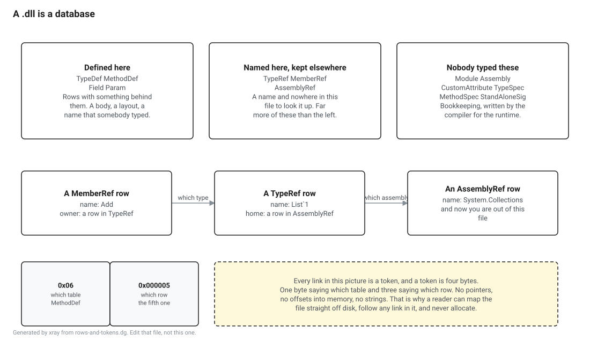

# Your code is data

What is actually inside the `.dll` you built.

T01 went past this file quickly, on the way to somewhere else. This lesson stops and opens it.

The short version is that an assembly is a database. Not a container of code with some descriptive material stuck on the front, a database, with tables, fixed width rows, and foreign keys. The code is one column in one of the tables. Everything else in the file exists to describe the code, and there is a great deal more description than there is code.

Once you have seen that, a lot of .NET stops being surprising. Reflection is a query. A decompiler is a report. A source generator, a serialiser, a dependency injection container and a mocking library are all doing the same thing, which is reading rows.

{{needs}}

Nothing here needs a debugger, a build of the runtime, or a privilege you do not already have. `System.Reflection.Metadata` ships in the box and it is what the runtime's own tools use.

## The program

From here to the end of the book, most lessons look at the same program. It is called L1 and it lives in `lessons/shared/l1`. Here it is in full.

```csharp
var shapes = new List<Shape> { new Circle(2), new Square(3), new Circle(5) };

double total = 0;

foreach (var shape in shapes)
{
    total += shape.Area();
}

Console.WriteLine($"{shapes.Count} shapes, {total:F2} total");

public abstract class Shape
{
    public abstract double Area();
}

public sealed class Circle(double radius) : Shape
{
    public override double Area() => Math.PI * radius * radius;
}

public sealed class Square(double side) : Shape
{
    public override double Area() => side * side;
}
```

It is deliberately the dullest C# I could write. That is the argument of the whole book in one program: the interesting machinery is not in clever code, it is under code like this, and you have been running code like this for years.



## The census

{{block:usings}}

{{block:open}}

Here is every table in the file that has anything in it.

{{block:census}}

{{output:census}}

Eighty seven rows. That is the entire program, everything the compiler concluded from those lines, in a file you could print out.

The left hand column is worth a note. Each table has a number, and the number is part of the format rather than an implementation detail. Table two is always TypeDef, on every assembly ever produced, by every compiler. That fixed numbering is what makes the next paragraph work.

A token is four bytes. The top byte is a table number and the bottom three are a row number, so `0x06000005` means the fifth row of table six, which is MethodDef. Every link inside the file is one of those. Not a pointer, not a name, not an offset into memory, a table number and a row number. That is why a metadata reader can map the file straight off disk and follow any link in it without allocating anything.

Notice also which tables are missing. There is no Property table and no Event table, because this program has neither. Tables that would be empty are not written at all, so the shape of the census is already telling you something about the program before you read a single row.

## Five types, and you wrote three

{{gate:types}}

{{block:types}}

{{output:types}}

Two of those five names could not be typed into a C# file. `<Module>` has angle brackets in it and so does `<Main>$`, which you will see in the next block. That is deliberate. A compiler that needs a name nobody can collide with picks a name nobody can write, and the angle brackets are how you spot compiler invented things for the rest of your life.

`BeforeFieldInit` on nearly every row is a flag about when static constructors are allowed to run, and it is on because none of these types has a static constructor. It costs nothing to know that now and it comes back in Part V.

## Eight methods, and you wrote four

{{block:methods}}

{{output:methods}}

You wrote three `Area` methods and the top level statements. The file has eight, and the other four are constructors.

Three of those constructors you never typed. C# gives a class without one a parameterless constructor that calls the base, including the abstract base, which is why `Shape` has a constructor at all despite being a type nobody can create. The fourth, `Circle..ctor`, you did write, in the sense that a primary constructor is a constructor.

The row numbers run in one unbroken sequence, one to eight, and they are grouped by type. That is not a coincidence and it is not the compiler being tidy. The MethodDef table has no column saying which type a method belongs to. The TypeDef table has a column saying where its methods start, and a type's methods are everything from there to where the next type's methods start. So methods have to be contiguous and in type order, or the format does not work.

## The names that made it, and the three that did not

Every name in the file lives in one long byte array, and a row that has a name holds an offset into it. Here is every name this assembly defines.

{{block:names}}

{{output:names}}

Thirteen names for a program with nine identifiers in it that a reader would call names. Two are the compiler's angle bracket inventions. Two more, `<radius>P` and `<side>P`, are the private fields that a primary constructor parameter turns into when the constructor body is not the only thing that uses it.

And three of the names in the source are not there at all.

{{gate:total}}

{{block:pdb}}

{{output:pdb}}

Zero and three. The split is not about what is worth keeping, it is about who can name the thing. A method name has to survive because other code says it out loud. A local variable is named by nobody outside the method it is in, so the IL refers to it by slot number and the name has no job left to do. It goes into the pdb, which is a second file in the same metadata format, with its own tables, holding the things the runtime never needs.

Two details in that output are worth a second look.

The slot numbers skip one. Slots zero, one and three have names and slot two does not, because slot two is the enumerator that the `foreach` needed and the compiler had no name to record for it. That gap is a small piece of evidence for something the next section is about.

And there are four source documents for a program written in one file. The other three are generated during the build, one for the global usings, one for the assembly level attributes and one for the target framework attribute. They exist on disk, in `obj`, and you can go and read them.

## What the program calls

The MemberRef table is the best value in the file. It lists every method the program calls that lives in some other assembly, in the order the compiler emitted them, which is close to the order they happen. It reads like a transcript.

{{gate:dispose}}

One piece of scaffolding first. Some of the owners in that table are generic instantiations rather than plain types, and a generic instantiation is not stored as text. It is a little tree of type codes, and the reader will walk the tree for you but insists that you supply the naming, because it has no opinion about how a type should be spelled. This is the smallest thing that answers it, and the only part this lesson uses is the line about generic instantiation.

{{block:naming}}

{{block:calls}}

{{output:calls}}

Read that list against the ten lines of source. It is not the same program.

The source says `foreach (var shape in shapes)`. The file says `GetEnumerator`, then `MoveNext` and `get_Current`, then `Dispose`. There is no `foreach` in IL. The compiler turned it into a call, a loop and a try with a finally, and the finally is where `Dispose` comes from.

The source says `$"{shapes.Count} shapes, {total:F2} total"`. The file says construct a `DefaultInterpolatedStringHandler`, then `AppendFormatted`, `AppendLiteral`, `AppendFormatted` again, then `ToStringAndClear`. There is no string interpolation in IL either. There is not even a string concatenation here, because the modern lowering builds the result through a handler struct instead, which is why an interpolated string in current .NET allocates less than the same code did a few versions ago.

This is the first sight of a thing the whole book keeps coming back to. C# is a language with features. IL is a language without most of them. Everything in between has to be turned into things IL has, and the turning is called lowering. T04 is about it properly. The MemberRef table is a good place to catch it happening, because it lists what a program does rather than what it says.

Two more things in that list. `Object..ctor` is there because every constructor calls its base constructor and the chain ends at `Object`. And `List<Shape>` appears with its type argument filled in, which means a generic instantiation got a row of its own, in the TypeSpec table, because the MemberRef table needs something to point at and `List<T>` on its own is not specific enough.

## It names far more than it holds

{{block:refs}}

{{output:refs}}

Five types defined, nineteen named. Twenty six members named, and none of those twenty six is in this file.

That ratio is normal and it gets more extreme as programs get bigger, because a program is mostly calls into things somebody else wrote. It is also the entire reason .NET can load lazily. Nothing in this file needs `List<T>` to exist until the line that uses it runs, because the reference is a name and a row number rather than an address that has to be right at load time.

Three assemblies at the bottom, and here is the odd part. Open the folder your program runs from and there is no `System.Runtime.dll` with a `List<T>` in it. There is a file with that name in the shared framework, but it contains no code at all, only a list of entries saying which assembly really has each type. The real one, for all three of these, is `System.Private.CoreLib`. Part III is where that indirection gets untangled, and it is the reason the previous lesson asked a running program which library `String` came from and got back a name the compiler had never heard of.

## Attributes are rows too

{{block:attributes}}

{{output:attributes}}

Fourteen attributes on a program that has none written on it anywhere.

Ten of them hang off the assembly and the build put them there. Company, product, title, configuration and the two version ones come from properties in the project file, or from defaults the SDK derives from the assembly name when the project file says nothing, which is the case here. The other four the compiler writes whatever you do. Two more hang off fields, marking the primary constructor backing fields as compiler generated. One hangs off the module and one off `Program`.

The order looks random and is not. The owner column is a coded index, which is a row number and a small tag saying which table that row is in, packed into a single number. The table is sorted by that number, which is why field row one comes first, then module row one, then all ten assembly rows, then field row two and then type row two. Several tables in the format are required to be sorted this way so that a reader looking for one owner's attributes can binary search for them instead of scanning the table. The database has indexes on it.

An attribute is a row with two useful columns. One says what it hangs off, and the other is a token naming a constructor, which is how the type name in the second column above was found: the token points at a MemberRef row, and that row points at the TypeRef row holding the name. The arguments are a blob, and a blob for a simple attribute is short enough to read by eye: a two byte prolog, then each fixed argument in order, then a count of named arguments. The last line walks that for the target framework attribute and pulls the string out.

Applying an attribute in C# looks like calling a constructor and it is not. Nothing runs at build time. The compiler writes down which constructor would be called and with what, and the constructor runs only if somebody asks for the attribute at run time, through reflection. Most attributes never run at all. They are read as data by something that never creates them, which is exactly what most of the ecosystem does with them.

## How big this gets

{{block:scale}}

{{asserts:scale}}

The numbers are dropped, because the second one belongs to whichever runtime you have installed. Run it and look: the program is two figures and the library it was built against is six.

That is one file. Types in the thousands and methods in the tens of thousands, all described in the same tables you have been reading, sitting in a file that gets memory mapped at startup and mostly never read. Almost none of it is touched by any given program, and the parts that are touched are found through the tables. Part IV is about how that stays fast.

## What your machine says

{{block:machine}}

{{asserts:machine}}

## What to take away

An assembly is a database. Tables, fixed width rows, and links that are table and row numbers rather than pointers.

Every link is a token, four bytes, one for the table and three for the row. That is the whole addressing scheme and it is why a reader can work straight off a mapped file.

The file holds more than you wrote. Types you did not declare, constructors you did not type, and attributes nobody applied.

The file holds less than you wrote. Local variable names, comments and formatting are gone, and the names went into the pdb next door.

What a program calls is a table you can read, and it does not match the source, because C# features get lowered into things IL has.

A program names far more than it contains, and the names are resolved late, which is why .NET can load lazily and why the assembly a compiler saw is often not the one a runtime loads.

## Where this goes next

T03 takes the one column this lesson skipped, which is the code itself, and reads it.

Part II is the whole of this in proper depth: how the tables are laid out on disk, how the row widths are decided, what a coded index is, and where the strings and blobs actually live. If the heaps in this lesson caught your interest, M03 is about them and you can read it now, out of order, without anything from Part I beyond this page.

## Sources

ECMA-335, sixth edition.

II.22 for the tables, one subsection per table, and II.22.2 for Assembly, II.22.15 for AssemblyRef, II.22.10 for CustomAttribute, II.22.15 for Field, II.22.25 for MemberRef, II.22.26 for MethodDef, II.22.37 for TypeDef and II.22.38 for TypeRef.

II.23.1.9 for how a token splits into a table number and a row number, and II.24.2.6 for the table stream, for coded indexes and the HasCustomAttribute encoding, for the sorted bitvector that says which tables are ordered, and for the rule that makes a type's methods contiguous.

II.23.3 for the custom attribute blob, including the two byte prolog and the trailing count of named arguments.

The portable pdb format is not in ECMA-335. It is specified in `dotnet/runtime` under `docs/design/specs/PortablePdb-Metadata.md`, and this lesson will cite it properly with a commit when the pin in `pin.json` lands. There are no `runtime:` citations here yet for the same reason as in T01.
