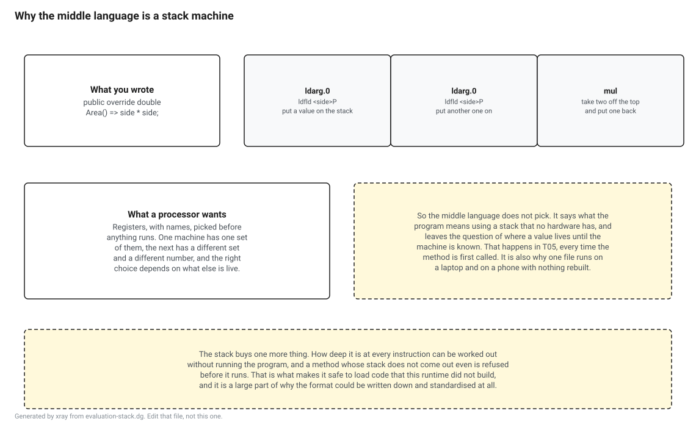

<!-- Generated by xray from lesson.src.md and lesson.cs. Do not edit this file, edit those two and run: dotnet run --project tools/xray -- build lessons -->

# The language under the language

What IL is, and why there is one at all.

T02 read every column of the assembly except one. This reads that one.

The runtime has never seen a `foreach`. It has never seen a `using`, a lambda, a `record`, a pattern, an `async` method or a primary constructor. None of those exist below the compiler. What the runtime is handed is a stream of bytes in a language with a couple of hundred instructions and no features at all, and everything C# has is built out of those.

That language is called IL. You will also see it called CIL, which is what the standard calls it, and MSIL, which is what it was called before the standard. They are the same thing and this book says IL.

This lesson runs on the stock SDK. Nothing to install beyond the one in the README.

Everything here reads the same file T02 read, with the same library that ships in the box. There is one difference: the disassembler on this page is written from scratch, in about thirty lines, because writing it is the fastest way to stop thinking of IL as something a tool shows you.

## The program

The same L1 as last time.

```csharp
var shapes = new List<Shape> { new Circle(2), new Square(3), new Circle(5) };

double total = 0;

foreach (var shape in shapes)
{
    total += shape.Area();
}

Console.WriteLine($"{shapes.Count} shapes, {total:F2} total");

public abstract class Shape
{
    public abstract double Area();
}

public sealed class Circle(double radius) : Shape
{
    public override double Area() => Math.PI * radius * radius;
}

public sealed class Square(double side) : Shape
{
    public override double Area() => side * side;
}
```

## Why there is a middle language at all



The short answer is that the compiler does not know what machine you are going to run on, and does not want to know.

A processor works with registers. There are sixteen general purpose ones on a current x64 chip and thirty one on arm64, they have names, and deciding which value goes in which one is a real problem with real consequences for speed. If C# compiled straight to machine code, the compiler would have to solve that problem, and it would have to solve it separately for every processor anyone might ever use, at the moment you press build, for a machine that is not in front of it.

So it does not solve it. It writes down what the program means, using a machine that does not exist and therefore has no registers to argue about, and leaves the register problem for later. Later is T05, and it happens on the machine that is going to run the code, which by then knows exactly what it is.

The imaginary machine is a stack machine. Every instruction takes its inputs off the top of a stack and leaves its output there. Nothing names a register, because there are none, and nothing names a memory address, because those are not known yet either.

There is a second reason, and it is the one that made the format worth standardising. Because every instruction says exactly what it does to the stack, the depth of the stack at every point in a method can be worked out by reading it, without running anything. A method whose stack does not come out even is rejected before it executes a single instruction. That is what makes it reasonable for a runtime to load and run code it did not build itself.

## The instruction set, without typing it out

You do not have to write the instruction table. It ships in the box, on `System.Reflection.Emit.OpCodes`, one public static field per instruction, and each one knows its own number, the shape of its operand and what it does to the stack.

```csharp
var opcodes = typeof(OpCodes)
    .GetFields(BindingFlags.Public | BindingFlags.Static)
    .Select(field => (OpCode)field.GetValue(null)!)
    .ToDictionary(op => (ushort)op.Value);

Console.WriteLine($"opcodes in the instruction set: {opcodes.Count}");
Console.WriteLine($"  one byte:  {opcodes.Values.Count(op => op.Size == 1)}");
Console.WriteLine($"  two bytes: {opcodes.Values.Count(op => op.Size == 2)}");
Console.WriteLine();

foreach (var op in new[] { OpCodes.Ldarg_0, OpCodes.Ldfld, OpCodes.Mul, OpCodes.Callvirt, OpCodes.Ret })
{
    Console.WriteLine($"  0x{(ushort)op.Value:X4}  {op.Name,-10} operand {op.OperandType,-14} pop {op.StackBehaviourPop,-10} push {op.StackBehaviourPush}");
}
```

```text
opcodes in the instruction set: 226
  one byte:  199
  two bytes: 27

  0x0002  ldarg.0    operand InlineNone     pop Pop0       push Push1
  0x007B  ldfld      operand InlineField    pop Popref     push Push1
  0x005A  mul        operand InlineNone     pop Pop1_pop1  push Push1
  0x006F  callvirt   operand InlineMethod   pop Varpop     push Varpush
  0x002A  ret        operand InlineNone     pop Varpop     push Push0
```

Two hundred and twenty six instructions is the whole language. Not a subset, not the common part, all of it. The C# specification runs to something over a thousand pages, and everything in it comes out as some arrangement of these.

Nearly all of them are one byte. The twenty seven that are not begin with the byte `0xFE` and take a second byte after it, which is what happens when a format designed around a single byte runs out of room and has to grow without breaking anything that already exists.

The last column matters more than it looks. `pop` and `push` are part of the definition of an instruction, not a note about it, which is what makes the checking in the previous section possible. Two of the rows say `Varpop` and `Varpush`, and those are the calls: how many values a call takes off the stack depends on how many parameters the thing being called has, so the answer is in the signature rather than in the instruction.

## A disassembler, and this is all of it

```csharp
int OperandSize(OperandType type) => type switch
{
    OperandType.InlineNone => 0,
    OperandType.ShortInlineBrTarget or OperandType.ShortInlineI or OperandType.ShortInlineVar => 1,
    OperandType.InlineVar => 2,
    OperandType.InlineI8 or OperandType.InlineR => 8,
    _ => 4,
};

IEnumerable<(int Offset, OpCode Op, string Text)> Decode(byte[] il)
{
    var at = 0;

    while (at < il.Length)
    {
        var start = at;
        var code = (ushort)il[at++];

        if (code == 0xFE)
        {
            code = (ushort)(0xFE00 | il[at++]);
        }

        var op = opcodes[code];
        var operand = at;
        at += OperandSize(op.OperandType);

        yield return (start, op, Render(op, il, operand, at));
    }
}
```

An opcode, then an operand whose length the opcode already told us, then the next opcode. That is the entire format of a method body. There is no framing, no separator and no length prefix on anything, because none is needed once you know what an instruction is.

The operands that are four bytes long are mostly tokens, and a token is the table and row pair from T02, so turning one into something readable is a lookup in the tables.

```csharp
string Render(OpCode op, byte[] il, int at, int next) => op.OperandType switch
{
    OperandType.InlineNone => "",
    OperandType.ShortInlineI => ((sbyte)il[at]).ToString(),
    OperandType.InlineI => BitConverter.ToInt32(il, at).ToString(),
    OperandType.ShortInlineVar => il[at].ToString(),
    OperandType.InlineVar => BitConverter.ToUInt16(il, at).ToString(),
    OperandType.ShortInlineR => BitConverter.ToSingle(il, at).ToString("R"),
    OperandType.InlineR => BitConverter.ToDouble(il, at).ToString("R"),
    OperandType.ShortInlineBrTarget => $"IL_{next + (sbyte)il[at]:X4}",
    OperandType.InlineBrTarget => $"IL_{next + BitConverter.ToInt32(il, at):X4}",
    _ => Named(BitConverter.ToInt32(il, at)),
};

string Named(int token)
{
    // A string literal is the one operand that does not point into the tables. It points into a
    // heap of its own, which is why ldstr is the only instruction here that needs a special case.
    if ((token >>> 24) == 0x70)
    {
        return $"\"{reader.GetUserString(MetadataTokens.UserStringHandle(token))}\"";
    }

    var handle = MetadataTokens.EntityHandle(token);

    switch (handle.Kind)
    {
        case HandleKind.MethodDefinition:
            var method = reader.GetMethodDefinition((MethodDefinitionHandle)handle);
            return $"{TypeName(method.GetDeclaringType())}.{reader.GetString(method.Name)}";
        case HandleKind.FieldDefinition:
            var field = reader.GetFieldDefinition((FieldDefinitionHandle)handle);
            return $"{TypeName(field.GetDeclaringType())}.{reader.GetString(field.Name)}";
        case HandleKind.MemberReference:
            var member = reader.GetMemberReference((MemberReferenceHandle)handle);
            return $"{Named(MetadataTokens.GetToken(member.Parent))}.{reader.GetString(member.Name)}";
        case HandleKind.MethodSpecification:
            var specific = reader.GetMethodSpecification((MethodSpecificationHandle)handle);
            var arguments = specific.DecodeSignature(new Naming(), reader);
            return $"{Named(MetadataTokens.GetToken(specific.Method))}<{string.Join(", ", arguments)}>";
        case HandleKind.TypeDefinition:
            return TypeName((TypeDefinitionHandle)handle);
        case HandleKind.TypeReference:
            return reader.GetString(reader.GetTypeReference((TypeReferenceHandle)handle).Name);
        case HandleKind.TypeSpecification:
            return reader.GetTypeSpecification((TypeSpecificationHandle)handle).DecodeSignature(new Naming(), reader);
        default:
            return handle.Kind.ToString();
    }
}

string TypeName(TypeDefinitionHandle handle) => reader.GetString(reader.GetTypeDefinition(handle).Name);

MethodDefinition Find(string type, string name) => reader.MethodDefinitions
    .Select(reader.GetMethodDefinition)
    .First(method => TypeName(method.GetDeclaringType()) == type && reader.GetString(method.Name) == name);

void Print(MethodDefinition method)
{
    foreach (var (offset, op, text) in Decode(image.GetMethodBody(method.RelativeVirtualAddress).GetILBytes()!))
    {
        Console.WriteLine($"  IL_{offset:X4}  {op.Name,-14} {text}".TrimEnd());
    }
}
```

One operand is not a token into the tables. A string literal points into a heap of its own, which is why `ldstr` needs a special case and nothing else does. T02 walked past that heap without stopping.

## The smallest method in the program

```csharp
Print(Find("Square", "Area"));
```

```text
  IL_0000  ldarg.0
  IL_0001  ldfld          Square.<side>P
  IL_0006  ldarg.0
  IL_0007  ldfld          Square.<side>P
  IL_000C  mul
  IL_000D  ret
```

Six instructions for `side * side`.

`ldarg.0` is `this`. In an instance method the arguments are numbered from zero and argument zero is the receiver, which is why an instance method with no parameters still has an argument.

`ldfld` takes the object off the top of the stack and puts the value of one of its fields there instead. The field it wants is the four byte token after the instruction, and here it names `<side>P`, which is the field a primary constructor parameter turns into. T02 found that name in the string heap and could not say what it was for.

`mul` takes two values off and puts one back. It does not say what kind of values, because it does not have to: what is on the stack got there from a field whose type is written down, and the rules of the format make it impossible for the two values to be different kinds.

The offsets are byte offsets rather than instruction numbers. `IL_0001` to `IL_0006` is five bytes because `ldfld` is one byte with a four byte token after it, and `IL_000C` to `IL_000D` is one because `mul` has no operand at all.

## How deep does it get

**Predict before you run it.** Square.Area needs two values on the stack at the deepest point, and never more. What does its method header say the maximum depth is?

- **A.** Two. The compiler worked it out, which is the whole reason the header has that field.
- **B.** Eight, and it says eight for almost every method in the program.
- **C.** Nothing. The runtime works it out when it loads the method.

<details>
<summary>Show the answer once you have picked one</summary>

**A is wrong.** The compiler did work it out. It then had nowhere to write it down, which is the part worth knowing.

**B is right.** There are two header formats. The small one is a single byte, and a single byte has room for the code length and nothing else, so the format fixes the maximum depth at eight and any method that fits gets that number whether it needs it or not. The large header is twelve bytes and has a real field, and a method only gets one when it is too big or too complicated for the small one.

**C is wrong.** The runtime could work it out, and it would rather not. The number is there so that the code that turns IL into machine code knows how much space to set aside before it starts, in one pass rather than two.

The number is a promise about the most, not a report of the actual, and the two failure modes are not symmetric. Writing down less than the method needs produces a file that is refused, because the code that allocates the stack would come up short. Writing down more than it needs costs nothing at all once the method is running. So rounding up is always safe, and the small header rounds up to eight for free.

</details>

```csharp
var walked = Find("Square", "Area");
var depth = 0;
var deepest = 0;

foreach (var (offset, op, _) in Decode(image.GetMethodBody(walked.RelativeVirtualAddress).GetILBytes()!))
{
    var pops = op.StackBehaviourPop switch
    {
        StackBehaviour.Pop0 => 0,
        StackBehaviour.Pop1 or StackBehaviour.Popref or StackBehaviour.Popi => 1,
        StackBehaviour.Pop1_pop1 => 2,
        // ret is the only one left here, and it pops the return value.
        _ => 1,
    };

    var pushes = op.StackBehaviourPush == StackBehaviour.Push0 ? 0 : 1;

    depth = depth - pops + pushes;
    deepest = Math.Max(deepest, depth);

    Console.WriteLine($"  IL_{offset:X4}  {op.Name,-8} pops {pops}  pushes {pushes}  stack now {depth}");
}

Console.WriteLine();
Console.WriteLine($"deepest the stack ever gets: {deepest}");
Console.WriteLine($"the method header claims:    {image.GetMethodBody(walked.RelativeVirtualAddress).MaxStack}");
```

```text
  IL_0000  ldarg.0  pops 0  pushes 1  stack now 1
  IL_0001  ldfld    pops 1  pushes 1  stack now 1
  IL_0006  ldarg.0  pops 0  pushes 1  stack now 2
  IL_0007  ldfld    pops 1  pushes 1  stack now 2
  IL_000C  mul      pops 2  pushes 1  stack now 1
  IL_000D  ret      pops 1  pushes 0  stack now 0

deepest the stack ever gets: 2
the method header claims:    8
```

Reading down the last column is the whole idea of a stack machine in one picture. It goes up, up again, comes back down when the multiply consumes both values, and finishes at nothing left over. A method that ended anywhere other than empty would be malformed, and would be refused rather than run.

The walk was short because the method runs straight through. Put a branch in and it stops being a matter of reading down a list, because the depth at a branch target has to come out the same however you arrive at it, and finding out means following every path into it. That rule is in the standard and the runtime enforces it, and it is the reason a stack that no hardware has can still be checked. The main method further down has three branches in it.

The last two lines disagree for the reason the gate gives, and the next section is the rest of that story.

## What sits in front of the instructions

```csharp
Console.WriteLine("  method                 header  maxstack  code  locals  init");

foreach (var handle in reader.MethodDefinitions)
{
    var method = reader.GetMethodDefinition(handle);
    var name = $"{TypeName(method.GetDeclaringType())}.{reader.GetString(method.Name)}";

    if (method.RelativeVirtualAddress == 0)
    {
        Console.WriteLine($"  {name,-22} no body at all, and the row says why: {method.Attributes & MethodAttributes.Abstract}");
        continue;
    }

    var body = image.GetMethodBody(method.RelativeVirtualAddress);
    var code = body.GetILBytes()!.Length;
    var locals = body.LocalSignature.IsNil
        ? 0
        : reader.GetStandaloneSignature(body.LocalSignature).DecodeLocalSignature(new Naming(), reader).Length;

    Console.WriteLine($"  {name,-22} {body.Size - code,6} {body.MaxStack,9} {code,5} {locals,7}  {body.LocalVariablesInitialized}");
}
```

```text
  method                 header  maxstack  code  locals  init
  Program.<Main>$            28         3   200       5  True
  Program..ctor               1         8     7       0  False
  Shape.Area             no body at all, and the row says why: Abstract
  Shape..ctor                 1         8     7       0  False
  Circle..ctor                1         8    14       0  False
  Circle.Area                 1         8    24       0  False
  Square..ctor                1         8    14       0  False
  Square.Area                 1         8    14       0  False
```

Two formats, and the difference is stark. Seven of the eight methods get a one byte header. The eighth gets twenty eight bytes.

A method qualifies for the small header when its code is short, it has no local variables and it has no exception handling. Everything about it is then implied: the maximum stack depth is eight, the locals are none, and there is nothing else to say. Almost every method anyone writes qualifies, which is the point, because a header is paid for once per method and there are a great many methods.

The large header is twelve bytes, and the twenty eight here is those twelve plus sixteen more for a table describing one exception region. It has room for a real maximum depth, which is why the main method says three rather than eight, and a token pointing at the list of local variable types, and a flag.

That flag is `init`, and it says whether the runtime has to write zeroes over the local variables before the method starts. It is on here, as it is in nearly all C# code, and it is why a local variable in .NET does not contain rubbish from whatever ran last. Turning it off is possible and is one of the few things in this book that will genuinely make a program faster and genuinely make it dangerous.

The token pointing at the local variable list points into a table called StandAloneSig. T02's census showed exactly one row in that table and offered no explanation. This is the explanation: one method in this program has locals, and that row is the list of their types.

The third line of the output is the abstract method. Its row exists, its name exists, its signature exists, and where the address of its body would be there is a zero. There is nothing to disassemble because there is nothing there, and the flag on the row says so.

## Two ways to call

**Predict before you run it.** List<T>.Add is not a virtual method. Which instruction does the compiler use to call it?

- **A.** call, because there is nothing to look up.
- **B.** callvirt, because callvirt throws when the thing being called on is null and call does not.
- **C.** callvirt, because the compiler cannot tell whether Add is virtual in another assembly.

<details>
<summary>Show the answer once you have picked one</summary>

**A is wrong.** There is nothing to look up, and the compiler uses callvirt anyway. The reason has nothing to do with looking anything up.

**B is right.** C# uses callvirt for an instance call on a reference type whether or not the target is virtual, because callvirt checks the receiver for null first and call does not. Without it, calling a method that never touches a field on a null reference would run happily, and the exception would turn up much later somewhere confusing.

**C is wrong.** It can tell. Whether a method is virtual is a flag on its row, and reading rows from another assembly is the ordinary case rather than the hard one.

There is one place where C# has to break its own rule, and it is worth knowing because it is the one case where a null receiver gets no check. Writing base.Something() in an override has to reach the base method, and callvirt would find the override again and call it forever, so the compiler emits call. Every base constructor call in this program is that case.

</details>

```csharp
foreach (var handle in reader.MethodDefinitions)
{
    var method = reader.GetMethodDefinition(handle);

    if (method.RelativeVirtualAddress == 0)
    {
        continue;
    }

    foreach (var (_, op, text) in Decode(image.GetMethodBody(method.RelativeVirtualAddress).GetILBytes()!))
    {
        if (op.OperandType == OperandType.InlineMethod)
        {
            Console.WriteLine($"  {op.Name,-10} {text}");
        }
    }
}
```

```text
  newobj     List`1<Shape>..ctor
  newobj     Circle..ctor
  callvirt   List`1<Shape>.Add
  newobj     Square..ctor
  callvirt   List`1<Shape>.Add
  newobj     Circle..ctor
  callvirt   List`1<Shape>.Add
  callvirt   List`1<Shape>.GetEnumerator
  call       Enumerator<Shape>.get_Current
  callvirt   Shape.Area
  call       Enumerator<Shape>.MoveNext
  callvirt   IDisposable.Dispose
  call       DefaultInterpolatedStringHandler..ctor
  callvirt   List`1<Shape>.get_Count
  call       DefaultInterpolatedStringHandler.AppendFormatted<Int32>
  call       DefaultInterpolatedStringHandler.AppendLiteral
  call       DefaultInterpolatedStringHandler.AppendFormatted<Double>
  call       DefaultInterpolatedStringHandler.AppendLiteral
  call       DefaultInterpolatedStringHandler.ToStringAndClear
  call       Console.WriteLine
  call       Object..ctor
  call       Object..ctor
  call       Shape..ctor
  call       Shape..ctor
```

Three instructions in this program carry a method token. `newobj` makes an object and runs a constructor on it in one step. `call` calls a method the code has already decided on. `callvirt` calls a method after checking the receiver is not null, and looks the method up at run time if it is virtual.

Only one line in that list is a call that cannot be settled until the program runs, and it is `callvirt Shape.Area`. Every other `callvirt` here is a null check in front of a method whose identity was decided at compile time, and everything called with `call` is either on a struct, or static, or a constructor.

You can read the inheritance out of the bottom of that list. `Shape..ctor` is called twice, once by `Circle` and once by `Square`. `Object..ctor` is called twice, once by `Shape` and once by `Program`. Every constructor in .NET calls one further up until the chain reaches `Object`, and this program is small enough that the whole chain fits in four lines.

## The whole program

**Predict before you run it.** The finally block disposes an enumerator that is a struct. Calling an interface method on a struct normally means boxing it onto the heap first. Does this program box, once for every loop it runs?

- **A.** Yes. That is the price of the interface, and it is why people say to avoid foreach in hot code.
- **B.** No. There is an instruction in front of the call whose only job is to say what the thing really is.
- **C.** No, because the finally block only runs if something throws.

<details>
<summary>Show the answer once you have picked one</summary>

**A is wrong.** It would be the price, if the format had no answer for it. It has one, and it is a single instruction long.

**B is right.** The constrained prefix names the exact type of the thing being called on. When that type is a struct that implements the method itself, the runtime skips the interface entirely and calls the struct's method directly, with the address it already has. No box, no allocation, no lookup.

**C is wrong.** A finally runs on the way out however the way out happens, and the normal path through this loop goes through it too. Look for the leave instruction and see where it lands.

This is the instruction that makes the answer to the dispose question in T02 come out to nothing. It is also conditional in a way worth remembering: if the struct did not implement the method itself, and inherited it from object instead, the prefix would have to box after all. That is why a struct that overrides Equals and GetHashCode behaves so differently in a dictionary from one that does not.

</details>

```csharp
var main = Find("Program", "<Main>$");
var mainBody = image.GetMethodBody(main.RelativeVirtualAddress);
var slots = reader.GetStandaloneSignature(mainBody.LocalSignature).DecodeLocalSignature(new Naming(), reader);

for (var slot = 0; slot < slots.Length; slot++)
{
    Console.WriteLine($"  local {slot}: {slots[slot]}");
}

foreach (var region in mainBody.ExceptionRegions)
{
    Console.WriteLine($"  {region.Kind}: try IL_{region.TryOffset:X4} to IL_{region.TryOffset + region.TryLength:X4}, handler IL_{region.HandlerOffset:X4} to IL_{region.HandlerOffset + region.HandlerLength:X4}");
}

Console.WriteLine();
Print(main);
```

```text
  local 0: List`1<Shape>
  local 1: Double
  local 2: Enumerator<Shape>
  local 3: Shape
  local 4: DefaultInterpolatedStringHandler
  Finally: try IL_0053 to IL_0071, handler IL_0071 to IL_007F

  IL_0000  newobj         List`1<Shape>..ctor
  IL_0005  dup
  IL_0006  ldc.r8         2
  IL_000F  newobj         Circle..ctor
  IL_0014  callvirt       List`1<Shape>.Add
  IL_0019  dup
  IL_001A  ldc.r8         3
  IL_0023  newobj         Square..ctor
  IL_0028  callvirt       List`1<Shape>.Add
  IL_002D  dup
  IL_002E  ldc.r8         5
  IL_0037  newobj         Circle..ctor
  IL_003C  callvirt       List`1<Shape>.Add
  IL_0041  stloc.0
  IL_0042  ldc.r8         0
  IL_004B  stloc.1
  IL_004C  ldloc.0
  IL_004D  callvirt       List`1<Shape>.GetEnumerator
  IL_0052  stloc.2
  IL_0053  br.s           IL_0066
  IL_0055  ldloca.s       2
  IL_0057  call           Enumerator<Shape>.get_Current
  IL_005C  stloc.3
  IL_005D  ldloc.1
  IL_005E  ldloc.3
  IL_005F  callvirt       Shape.Area
  IL_0064  add
  IL_0065  stloc.1
  IL_0066  ldloca.s       2
  IL_0068  call           Enumerator<Shape>.MoveNext
  IL_006D  brtrue.s       IL_0055
  IL_006F  leave.s        IL_007F
  IL_0071  ldloca.s       2
  IL_0073  constrained.   Enumerator<Shape>
  IL_0079  callvirt       IDisposable.Dispose
  IL_007E  endfinally
  IL_007F  ldloca.s       4
  IL_0081  ldc.i4.s       15
  IL_0083  ldc.i4.2
  IL_0084  call           DefaultInterpolatedStringHandler..ctor
  IL_0089  ldloca.s       4
  IL_008B  ldloc.0
  IL_008C  callvirt       List`1<Shape>.get_Count
  IL_0091  call           DefaultInterpolatedStringHandler.AppendFormatted<Int32>
  IL_0096  ldloca.s       4
  IL_0098  ldstr          " shapes, "
  IL_009D  call           DefaultInterpolatedStringHandler.AppendLiteral
  IL_00A2  ldloca.s       4
  IL_00A4  ldloc.1
  IL_00A5  ldstr          "F2"
  IL_00AA  call           DefaultInterpolatedStringHandler.AppendFormatted<Double>
  IL_00AF  ldloca.s       4
  IL_00B1  ldstr          " total"
  IL_00B6  call           DefaultInterpolatedStringHandler.AppendLiteral
  IL_00BB  ldloca.s       4
  IL_00BD  call           DefaultInterpolatedStringHandler.ToStringAndClear
  IL_00C2  call           Console.WriteLine
  IL_00C7  ret
```

Two hundred bytes. Read it against the ten lines of source, because most of what is interesting on this page is in the gap between the two.

**Five local slots for three variables.** Slots zero, one and three are `shapes`, `total` and `shape`. Slot two is the enumerator the `foreach` needed and slot four is the handler the interpolated string needed, and nobody wrote either. T02 found three local names in the pdb and a gap where slot two should be, and could not say what was in the gap. This is what was in it.

**The list is built with `dup`.** `newobj`, then `dup`, then the item, then `Add`, three times over, and only one `stloc` at the end. `Add` returns nothing and takes the list off the stack, so the list has to be duplicated before each call to have anything left for the next one. That is what a collection initializer is.

**There is no conversion instruction anywhere in the program.** The source says `new Circle(2)` with an integer, and the file says `ldc.r8` with a floating point two in it. The conversion happened while you were compiling, and the same thing happened to the line that starts `total` off at zero.

**The loop is tested at the bottom.** The first thing the loop does is branch forward to `IL_0066`, where the enumerator is loaded and `MoveNext` is called, and the body of the loop sits above that. One branch per iteration instead of two, and this shape is so standard that seeing it is how you recognise a loop in code you have never read.

**The enumerator is never copied.** Every touch of slot two is `ldloca.s`, which loads its address, rather than `ldloc`, which would load its value. It is a struct, and the code works on it where it lies.

**There is a try and a finally, and the source has neither.** `leave.s` at `IL_006F` is how you get out of a protected region, `endfinally` at `IL_007E` is the end of the handler, and the region itself was declared in the header rather than in the instructions. T02 predicted this from a single row in the MemberRef table. Here it is.

**One call in the whole program is genuinely virtual.** `callvirt Shape.Area` at `IL_005F` is the only place the runtime has to work out which method to run, and it has to do it on every iteration. T06 is about what happens to that call once the runtime has watched it a few times.

**The interpolated string was measured at compile time.** `ldc.i4.s` with fifteen in it and `ldc.i4.2` are the arguments to the handler's constructor: fifteen characters of literal text and two holes to fill. The literal parts are `" shapes, "` and `" total"`, which are nine characters and six. The compiler counted them so that the handler can ask for a buffer of the right size once instead of growing one.

**Nothing is boxed.** `AppendFormatted<Int32>` and `AppendFormatted<Double>` are generic, instantiated for the exact types, so the count and the total go in as themselves. On an older .NET this line allocated a boxed integer, a boxed double and several intermediate strings.

## Counted

```csharp
var used = new List<OpCode>();
var bytes = 0;
var bodies = 0;

foreach (var handle in reader.MethodDefinitions)
{
    var method = reader.GetMethodDefinition(handle);

    if (method.RelativeVirtualAddress == 0)
    {
        continue;
    }

    bodies++;
    var il = image.GetMethodBody(method.RelativeVirtualAddress).GetILBytes()!;
    bytes += il.Length;
    used.AddRange(Decode(il).Select(instruction => instruction.Op));
}

Console.WriteLine($"methods with a body:  {bodies}");
Console.WriteLine($"bytes of IL in total: {bytes}");
Console.WriteLine($"instructions:         {used.Count}");
Console.WriteLine($"distinct opcodes:     {used.Select(op => op.Name).Distinct(StringComparer.Ordinal).Count()} of the {opcodes.Count} that exist");
Console.WriteLine();

foreach (var group in used.GroupBy(op => op.Name!).OrderByDescending(group => group.Count()).ThenBy(group => group.Key, StringComparer.Ordinal))
{
    Console.WriteLine($"  {group.Key,-14} {group.Count(),2}");
}
```

```text
methods with a body:  7
bytes of IL in total: 280
instructions:         90
distinct opcodes:     28 of the 226 that exist

  call           13
  ldarg.0        10
  ldloca.s        9
  callvirt        7
  ret             7
  ldc.r8          5
  ldfld           4
  newobj          4
  dup             3
  ldstr           3
  mul             3
  ldarg.1         2
  ldloc.0         2
  ldloc.1         2
  stfld           2
  stloc.1         2
  add             1
  br.s            1
  brtrue.s        1
  constrained.    1
  endfinally      1
  ldc.i4.2        1
  ldc.i4.s        1
  ldloc.3         1
  leave.s         1
  stloc.0         1
  stloc.2         1
  stloc.3         1
```

Twenty eight distinct instructions. That is what an ordinary program is made of, out of a set eight times the size.

Most of the instruction set is not for code like this. There are arithmetic instructions for unsigned types and for checked arithmetic, loads and stores through raw pointers, prefixes for unaligned access, volatile access and tail calls, and a whole family for arrays with more than one dimension. They exist because the format is meant to be a target for more than one language and for code generators that are not compilers, and a program written the way people write programs touches almost none of them.

The frequency list is a fair picture of what a program does. Load something, call something, store the answer. `call` and `callvirt` together are a little over a fifth of every instruction in the program, which is the ordinary case and is the reason so much of the rest of this book is about making a call cheap.

## How much of it there is

```csharp
long Bytes(string file)
{
    using var open = File.OpenRead(file);
    using var pe = new PEReader(open);
    var metadata = pe.GetMetadataReader();

    return metadata.MethodDefinitions
        .Select(metadata.GetMethodDefinition)
        .Where(method => method.RelativeVirtualAddress != 0)
        .Sum(method => (long)pe.GetMethodBody(method.RelativeVirtualAddress).GetILBytes()!.Length);
}

var mine = Bytes(assemblyFile);
var corelib = Bytes(typeof(object).Assembly.Location);

Console.WriteLine($"L1.dll                 {mine,9} bytes of IL");
Console.WriteLine($"System.Private.CoreLib {corelib,9} bytes of IL");
Console.WriteLine($"the library is more than two thousand times the program: {corelib > mine * 2000}");
```

**Checked, though the output is not on this page.** That block prints something different on every machine, so nothing is stored and nothing can be quoted. These are the things that are true of it everywhere, and the build fails on any platform where one of them stops being true.

- Exactly 3 lines. One line for the program, one for the library it was built against, and the comparison between them. The comparison is the only line that is a statement about .NET rather than about whichever runtime happens to be installed.
- A line matches `^L1\.dll +[0-9]+ bytes of IL$`. The program's own total is small and stable, but it is printed next to a number that is neither, so the pair is dropped together and the shape is what is left to check.
- Contains `the library is more than two thousand times the program: True`. The load bearing claim. Two thousand is well under the real ratio, which is over five thousand today, and it is set low so that a future library shedding a few hundred thousand bytes of IL does not turn a true statement red.

The numbers are dropped because the second one belongs to whichever runtime is installed. Run it and look at the gap. Every one of those bytes goes through the same decoding this page does, on the way to becoming machine code, and almost none of it is ever touched by any one program. Part IV is about how that stays affordable.

## What your machine says

```csharp
Console.WriteLine($"runtime:  {RuntimeInformation.FrameworkDescription}");
Console.WriteLine($"platform: {RuntimeInformation.RuntimeIdentifier}");
```

**Checked, though the output is not on this page.** That block prints something different on every machine, so nothing is stored and nothing can be quoted. These are the things that are true of it everywhere, and the build fails on any platform where one of them stops being true.

- Exactly 2 lines. The two facts on this page that are different for every reader, kept in one place so that nothing else on the page has to be.
- A line matches `^platform: (linux|osx|win)-(x64|arm64)$`. One of the four platforms this book supports. Anything else means the lesson ran somewhere nobody has checked, and every instruction listing on the page is then a claim about a machine rather than about .NET.
- A line matches `^runtime:  \.NET [0-9]+\.[0-9]+\.[0-9]+$`. A three part version, which is what the runtime reports when it is a release rather than a preview. It matters here because the instruction listings are what one specific compiler emitted, and a reader who sees different ones needs to know whether they are on something unusual.

## What to take away

IL is a real language with a small instruction set, and it is written down in a standard you can read.

It is a stack machine because a stack machine has nothing in it that depends on the processor, which leaves the decision about registers until the processor is known.

Every instruction declares what it does to the stack, which is what lets a runtime check a method before running it, which is what makes it safe to load code from somewhere else.

A method body is a header and then instructions, and the header is one byte when the method is small and plain, which is nearly always.

`call` and `callvirt` are not about what you wrote. `callvirt` is a null check first and a lookup second, and only one call in this program is a lookup.

The listing does not match the source, and the places where it does not are where the interesting parts of .NET are.

## Where this goes next

T04 takes the gap between those ten lines of C# and these two hundred bytes and makes it the subject. The `foreach` that turned into four calls and a finally, the interpolated string that turned into a struct, and the ones this program did not reach.

T05 takes this same IL and turns it into machine code, which is when the register problem this page is about finally gets solved.

Part II covers the physical layout in the same detail T02's part covers the tables: what a fat header looks like byte by byte, how exception clauses are encoded, and where the local variable signature lives.

## Sources

ECMA-335, sixth edition.

Partition III is the instruction set. III.1 is the introduction, including the operand type table and the stack behaviour of each instruction, III.2 is the prefixes, with the constrained prefix in III.2.1, and III.3 and III.4 are the instructions themselves, one section each.

II.25.4 for the physical layout of a method body, with the small header in II.25.4.2, the large one in II.25.4.3, and the exception handling clauses in II.25.4.6. The rule that fixes the maximum stack depth at eight for the small header is in II.25.4.2.

II.23.2.6 for the local variable signature, and II.22.36 for the StandAloneSig table that holds it.

There are no `runtime:` citations here for the same reason as in T01 and T02. `pin.json` holds a null commit, so nothing in the runtime tree can be cited yet, and a citation that does not resolve is not accepted by the build.
